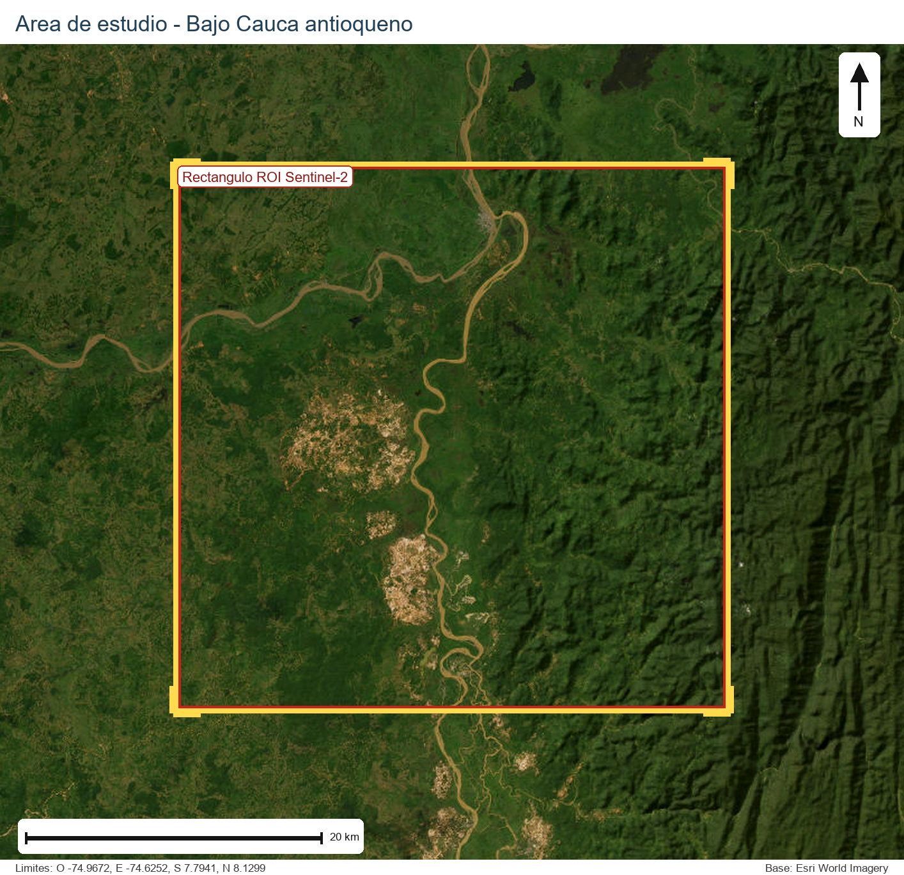

<style>
body {
  text-align: justify;
  line-height: 1.7;
}

h1, h2, h3 {
  font-weight: 700;
}

h1 {
  border-bottom: 3px solid #2c7fb8;
  padding-bottom: 0.3rem;
  margin-top: 1.2rem;
}

h2 {
  color: #1f5f8b;
  margin-top: 1.5rem;
}

h3 {
  color: #2c7a7b;
}

.caja-suave {
  background: #f7fbff;
  border-left: 6px solid #2c7fb8;
  padding: 1rem 1.2rem;
  border-radius: 8px;
  margin: 1rem 0;
}

.caja-verde {
  background: #f3fbf6;
  border-left: 6px solid #2ca25f;
  padding: 1rem 1.2rem;
  border-radius: 8px;
  margin: 1rem 0;
}

.caja-morada {
  background: #faf7ff;
  border-left: 6px solid #7a4ebf;
  padding: 1rem 1.2rem;
  border-radius: 8px;
  margin: 1rem 0;
}

.caja-alerta {
  background: #fff8ef;
  border-left: 6px solid #d97706;
  padding: 1rem 1.2rem;
  border-radius: 8px;
  margin: 1rem 0;
}

pre, code {
  border-radius: 8px;
}

pre code {
  font-size: 0.95rem;
}

table {
  width: 100%;
  margin: 1rem 0;
}

th {
  background-color: #eaf4fb !important;
}

blockquote {
  border-left: 5px solid #2c7fb8;
  background: #f8fbfd;
  padding: 0.8rem 1rem;
  border-radius: 6px;
}
</style>

# Resumen

Este proyecto desarrolla un flujo de trabajo reproducible para clasificar zonas
asociadas a mineria de oro de aluvion mediante imagenes Sentinel-2, puntos
etiquetados y aprendizaje automatico supervisado. El modelo principal es un
**Random Forest** binario orientado a separar las clases **Mineria** y
**No Mineria** a partir de bandas espectrales e indices derivados como NDVI,
MSAVI, NDWI, BSI, MBSI, NDSI, MSWI y NDBI.

El flujo se implementa en Python con Kedro, de manera que cada etapa queda
organizada en pipelines, nodos, parametros y catalogos de datos. Esta
estructura permite documentar y repetir el proceso desde la adquisicion de
imagenes Sentinel-2 en Google Earth Engine hasta la generacion de mapas
clasificados, salidas de validacion y productos cartograficos derivados.

::: {.caja-alerta}
**Alcance acotado del proyecto.** Para favorecer la replicabilidad, el proyecto
se concentra exclusivamente en Sentinel-2 como fuente satelital abierta. No se
incluyen imagenes PlanetScope ni fusiones multifuente en la implementacion
principal. El uso de otros sensores o modelos queda como extension futura.
:::

# Introduccion y justificacion

La mineria de oro de aluvion es una de las formas de extraccion de minerales
mas controvertidas por sus impactos sociales y ambientales. Esta actividad se
desarrolla con frecuencia en cauces, terrazas aluviales y zonas cercanas a
redes hidrograficas, donde puede generar perdida de cobertura vegetal,
degradacion de suelos, sedimentacion, transformacion del paisaje y afectaciones
asociadas al uso de sustancias contaminantes [@perez2016impactos;
@bansah2022guns; @cardona2022highly].

Desde la geomatica, la combinacion de Sistemas de Informacion Geografica,
teledeteccion y programacion permite construir metodologias para observar estos
cambios en el territorio. Sin embargo, la identificacion de mineria de oro de
aluvion mediante sensores remotos presenta desafios tecnicos: las areas
intervenidas tienen respuestas espectrales heterogeneas, pueden confundirse con
suelo desnudo o zonas construidas, y su distribucion espacial suele ser
fragmentada y dinamica.

En Colombia, entidades como la UNODC han usado imagenes satelitales para
monitorear explotacion de oro de aluvion [@unodc2022evidencias]. Aunque estos
productos son valiosos, la generacion de reportes institucionales puede tener
desfases temporales y no siempre entrega un flujo replicable desde el codigo.
En este contexto, un proyecto reproducible con datos abiertos, parametros
explicitos y aprendizaje automatico ofrece una alternativa academica para
automatizar parte del proceso de identificacion y evaluarlo de manera
transparente.

La propuesta se centra en Sentinel-2 porque es un sensor libre, con cobertura
global, resolucion espacial adecuada para una primera aproximacion regional y
bandas multiespectrales utiles para discriminar vegetacion, humedad, suelo
desnudo y superficies alteradas. El enfoque con Random Forest se selecciona por
su robustez en problemas de clasificacion supervisada, su capacidad para
trabajar con variables correlacionadas y la interpretabilidad relativa de sus
importancias de variables.

# Estado del Arte / Revision Bibliografica

El estudio de la mineria de oro de aluvion desde una perspectiva geoespacial ha
cobrado interes con el avance de las tecnologias de observacion de la Tierra,
los SIG y las herramientas de programacion aplicadas al analisis espacial. La
literatura reciente muestra que la combinacion de imagenes satelitales,
procesamiento digital, indices espectrales y aprendizaje automatico puede
apoyar la identificacion y monitoreo de zonas mineras.

En el contexto internacional, [@ngom2022recent] identificaron y cuantificaron
la expansion de areas afectadas por mineria en el rio Bandama, Costa de Marfil,
durante el periodo 2018-2021 usando imagenes Sentinel-2 y algoritmos de
aprendizaje automatico. Este tipo de estudios evidencia el potencial de sensores
abiertos para monitorear mineria artesanal o de pequena escala en contextos
tropicales.

Otros trabajos han explorado aproximaciones multiespectrales, radar o modelos
mas complejos. [@nursamsi2024feasibility] analizaron la factibilidad de fusionar
datos multiespectrales y SAR para mapear mineria artesanal en Indonesia;
[@vanrensburg2022sar] integraron datos SAR y aprendizaje automatico para
detectar mineria de pequena escala; y [@saputra2025multimodal] revisaron
enfoques de aprendizaje profundo para segmentar huellas mineras. Aunque estos
antecedentes muestran el avance del campo, el presente proyecto toma una
decision metodologica mas acotada: usar solo Sentinel-2 y un modelo supervisado
principal, con el fin de priorizar trazabilidad y replicabilidad.

A nivel nacional, Castellanos [@castellanos2016tesis] y Castellanos et al.
[@castellanos2017detection] desarrollaron una metodologia para clasificar zonas
mineras a cielo abierto mediante fusion de imagenes, indices espectrales y
clasificacion orientada a objetos en el nororiente de Antioquia. Por su parte,
[@ibrahim2020small] aplicaron imagenes gratuitas para detectar mineria aurifera
de pequena escala, y [@sandoval2022metodologia] utilizaron imagenes Sentinel-1
en Choco para enfrentar condiciones de nubosidad persistente.

Estos trabajos confirman que los sensores remotos son una fuente clave para
analizar la mineria. No obstante, muchos estudios se concentran en el resultado
cartografico o en una tecnica especifica, sin publicar necesariamente una
estructura reproducible completa desde la adquisicion de datos hasta la
validacion. La oportunidad de este proyecto esta en organizar todo el flujo con
Kedro, de forma que las decisiones tecnicas queden versionadas en codigo,
parametros y salidas intermedias.

# Objetivos

## Pregunta guia

> Como construir un flujo reproducible para clasificar zonas de mineria de oro
> de aluvion usando imagenes Sentinel-2, variables espectrales y un modelo
> Random Forest?

## Objetivo general

::: {.caja-verde}
Desarrollar un flujo de trabajo reproducible para la clasificacion binaria de
zonas asociadas a mineria de oro de aluvion a partir de imagenes Sentinel-2,
variables espectrales y un modelo Random Forest implementado en Python con
Kedro.
:::

## Objetivos especificos

::: {.caja-verde}
1. Implementar un flujo reproducible para adquirir, componer y transformar
imagenes Sentinel-2 en variables espectrales de entrenamiento mediante Google
Earth Engine, Python y Kedro.

2. Entrenar, evaluar y aplicar un modelo Random Forest para generar mapas de
clasificacion y probabilidad de mineria, junto con salidas de posprocesamiento
y validacion espacial.
:::

# Alcance del proyecto

El proyecto incluye la consulta y descarga de Sentinel-2 desde Google Earth
Engine, el calculo de indices espectrales, la preparacion de puntos etiquetados,
la extraccion de variables por punto, el analisis exploratorio con PCA, el
entrenamiento del Random Forest, la prediccion raster, el posprocesamiento
espacial y la validacion tabular/cartografica.

El proyecto no incluye imagenes PlanetScope, fusion multifuente, modelos de
aprendizaje profundo ni un sistema operacional de alertas tempranas en tiempo
real. Estas alternativas se dejan como posibles extensiones metodologicas.

# Area de Estudio

El area de estudio se ubica en el Bajo Cauca antioqueno, una subregion con
presencia historica de mineria de oro de aluvion y transformaciones
territoriales asociadas a esta actividad. En el plan inicial se consideraron
los municipios de **Nechi** y **Caucasia** como zona de interes por su
representatividad dentro de la dinamica minera regional.

En la implementacion del repositorio, el area operativa se define mediante un
poligono GeoJSON parametrizado para Google Earth Engine. Este poligono cubre un
sector del Bajo Cauca con los siguientes limites aproximados:

| Limite | Valor |
|---|---:|
| Longitud minima | -74.96723392 |
| Longitud maxima | -74.62519767 |
| Latitud minima | 7.79405091 |
| Latitud maxima | 8.12991298 |

La @fig-area-estudio muestra el rectangulo operativo usado como area de
consulta y descarga para Sentinel-2. El mapa base corresponde a una imagen
satelital de Esri World Imagery, porque permite observar con mayor claridad el
contexto fisico del territorio, la red hidrografica y las zonas con superficies
expuestas.

{#fig-area-estudio fig-align="center" width="90%"}

# Fuentes de Datos

| Fuente | Rol en el proyecto | Condicion de replicabilidad |
|---|---|---|
| Sentinel-2 SR Harmonized | Imagen multiespectral base | Abierta mediante Google Earth Engine |
| Puntos etiquetados | Entrenamiento y prueba del modelo | Archivo vectorial local del proyecto |
| Parametros YAML | Control de ROI, fechas, bandas, indices y modelo | Versionados en `conf/base/parameters` |
| Catalogos Kedro | Definicion de entradas y salidas | Versionados en `conf/base/catalog` |

La fuente satelital usada por el codigo es `COPERNICUS/S2_SR_HARMONIZED`.
La configuracion actual trabaja con una ventana temporal corta, filtro de
nubosidad y composicion mediana. Las bandas consideradas son:

```yaml
collection: COPERNICUS/S2_SR_HARMONIZED
bands: [B1, B2, B3, B4, B5, B6, B7, B8, B8A, B9, B11, B12]
scale: 10
cloud_cover_max: 10
cloud_mask: true
composite_method: median
```

# Metodologia y Codigo

::: {.caja-morada}
El proyecto se desarrolla en Visual Studio Code con un entorno virtual de
Python. Kedro organiza el flujo en pipelines, nodos, parametros y catalogos de
datos, lo que permite separar responsabilidades, repetir ejecuciones y rastrear
las salidas generadas por cada etapa.
:::

La estructura principal del repositorio es:

```text
conf/
  base/
    catalog/        # Entradas y salidas declaradas para Kedro
    parameters/     # Parametros por pipeline
data/
  01_raw/           # Datos fuente
  03_primary/       # Datos primarios tabulares
  05_model_input/   # Insumos de entrenamiento y prueba
  06_models/        # Modelos entrenados
  07_model_output/  # Mapas y vectores derivados del modelo
  08_reporting/     # Figuras y metadatos para reporte
src/
  centromonitoreo_mineria/
    pipeline_registry.py
    pipelines/
tests/
```

El registro central de pipelines se encuentra en
`src/centromonitoreo_mineria/pipeline_registry.py`:

```python
def register_pipelines() -> dict[str, Pipeline]:
    return {
        "download_sentinel2": download_sentinel2_pipeline(),
        "sentinel2_spectral_indices": sentinel2_spectral_indices_pipeline(),
        "prepare_training_data": prepare_training_data_pipeline(),
        "extract_sentinel2_training_features": extract_sentinel2_training_features_pipeline(),
        "analyze_sentinel2_pca": analyze_sentinel2_pca_pipeline(),
        "train_mining_binary_rf": train_mining_binary_rf_pipeline(),
        "predict_mining_binary_map": predict_mining_binary_map_pipeline(),
        "postprocess_mining_binary_map": postprocess_mining_binary_map_pipeline(),
        "validate_mining_binary_map": validate_mining_binary_map_pipeline(),
        "validate_postprocessed_mining_map": validate_postprocessed_mining_map_pipeline(),
        "__default__": download_sentinel2_pipeline() + prepare_training_data_pipeline(),
    }
```

## Flujo de trabajo implementado

```{mermaid}
flowchart LR
  A[ROI y parametros YAML] --> B[Descarga Sentinel-2]
  B --> C[Composicion y mascara de nubes]
  C --> D[Bandas e indices espectrales]
  E[Puntos etiquetados] --> F[Preparacion y particion]
  D --> G[Extraccion de variables por punto]
  F --> G
  G --> H[PCA exploratorio]
  G --> I[Random Forest binario]
  I --> J[Metricas e importancia de variables]
  I --> K[Prediccion raster]
  K --> L[Mapa de probabilidad]
  K --> M[Mapa binario]
  M --> N[Posprocesamiento espacial]
  J --> O[Validacion tabular]
  N --> P[Validacion cartografica]
```

## Etapas principales

| Etapa | Pipeline | Producto principal |
|---|---|---|
| Descarga Sentinel-2 | `download_sentinel2` | Bandas Sentinel-2 exportadas desde Google Earth Engine |
| Indices espectrales | `sentinel2_spectral_indices` | Bandas originales e indices derivados |
| Preparacion de puntos | `prepare_training_data` | Puntos validados y particion entrenamiento/prueba |
| Extraccion de variables | `extract_sentinel2_training_features` | Tablas con respuesta espectral por punto |
| Analisis exploratorio | `analyze_sentinel2_pca` | Varianza explicada, cargas y graficos PCA |
| Entrenamiento | `train_mining_binary_rf` | Modelo Random Forest, metricas e importancia de variables |
| Prediccion | `predict_mining_binary_map` | Mapa de clases y mapa de probabilidad |
| Posprocesamiento | `postprocess_mining_binary_map` | Mapa filtrado por area minima y poligonos |
| Validacion | `validate_mining_binary_map`, `validate_postprocessed_mining_map` | Mapas de errores y resumen de validacion |

## Procesamiento Sentinel-2

### Composicion de imagenes

La composicion se construye en
`pipelines/helper/google_earth_engine/sentinel2_composite.py`. El codigo permite
usar mediana, media o mosaico y aplicar, cuando corresponde, el factor de
escala de reflectancia.

```python
def build_composite_image(sentinel2_image_collection: Any, params: dict) -> Any:
    method = params.get("composite_method", "median")
    composite_methods = {
        "median": sentinel2_image_collection.median,
        "mean": sentinel2_image_collection.mean,
        "mosaic": sentinel2_image_collection.mosaic,
    }
    if method not in composite_methods:
        raise ValueError(
            "sentinel2_download.composite_method debe ser median, mean o mosaic."
        )

    image = composite_methods[method]()
    image = _set_reference_projection(image, sentinel2_image_collection, params)
    if params.get("apply_reflectance_scale", True):
        return image.multiply(params.get("reflectance_scale_factor", 0.0001)).toFloat()
    return image
```

Esta etapa es clave porque define la imagen base sobre la cual se calculan las
variables del modelo. La composicion mediana reduce la influencia de valores
atipicos y facilita obtener una representacion sintetica del periodo de
interes.

### Indices espectrales

Los indices espectrales agregan informacion fisica al modelo y ayudan a
separar respuestas asociadas a vegetacion, agua, humedad, suelo desnudo,
residuos solidos y superficies alteradas.

| Indice | Formula configurada | Uso esperado |
|---|---|---|
| NDVI | `(B8 - B4) / (B8 + B4)` | Contraste de vegetacion |
| MSAVI | Expresion ajustada con NIR y rojo | Vegetacion con influencia de suelo |
| NDWI | `(B3 - B8) / (B3 + B8)` | Humedad y cuerpos de agua |
| BSI | `((B11 + B4) - (B8 + B2)) / ((B11 + B4) + (B8 + B2))` | Suelo desnudo |
| MBSI | `(B11 - B4) / (B11 + B4)` | Suelo desnudo modificado |
| NDSI | `(B11 - B3) / (B11 + B3)` | Contraste suelo/vegetacion |
| MSWI | `(B12 - B4) / (B12 + B4)` | Residuos solidos mineros |
| NDBI | `(B11 - B8) / (B11 + B8)` | Suelo expuesto o areas construidas |

El calculo se controla desde YAML y se ejecuta con una funcion generica:

```python
def build_sentinel2_indices_image(sentinel2_composite_image: Any, params: dict[str, Any]) -> Any:
    index_images = [
        _calculate_index(sentinel2_composite_image, name, config)
        for name, config in params["indices"].items()
        if config.get("enabled", True)
    ]
    if not index_images:
        raise ValueError("No hay indices activos para calcular.")

    image = index_images[0]
    for index_image in index_images[1:]:
        image = image.addBands(index_image)
    if params.get("include_original_bands", True):
        image = sentinel2_composite_image.select(params["bands"]).addBands(image)
    if params.get("output_band_order"):
        image = image.select(params["output_band_order"])
    return image.toFloat()


def _calculate_index(image: Any, name: str, config: dict[str, Any]) -> Any:
    formula = config["formula"]
    bands = config["bands"]
    if formula == "normalized_difference":
        return image.normalizedDifference([bands["first"], bands["second"]]).rename(name)
    return image.expression(
        config["expression"],
        {alias: image.select(band_name) for alias, band_name in bands.items()},
    ).rename(name)
```

Esta organizacion permite agregar, desactivar o ajustar indices desde archivos
de configuracion sin modificar el codigo de procesamiento.

## Preparacion de datos de entrenamiento

Los puntos etiquetados se almacenan como datos vectoriales locales y contienen
la columna `Cobertura`. El flujo valida los campos, reproyecta cuando es
necesario y separa los datos en entrenamiento y prueba.

```yaml
training_data:
  labeled_points_path: data/01_raw/labeled_points/Datos_Entrenamiento.shp
  label_column: Cobertura
  target_crs: EPSG:9377
  test_size: 0.2
  random_state: 42
  stratify: true
```

La particion estratificada ayuda a conservar la proporcion de clases en los
conjuntos de entrenamiento y prueba. Ademas, el pipeline genera reportes de
distribucion espacial y distribucion por clase, utiles para revisar sesgos de
muestreo.

### Extraccion de variables por punto

Cada punto se cruza con la imagen Sentinel-2 y sus indices espectrales. El
resultado son dos tablas: una de entrenamiento y otra de prueba.

```python
def create_pipeline(**kwargs) -> Pipeline:
    return Pipeline(
        [
            node(
                func=validate_sentinel2_training_features_config,
                inputs=[
                    "params:gee",
                    "params:sentinel2_spectral_indices",
                    "params:sentinel2_training_features",
                ],
                outputs="sentinel2_training_features_config",
            ),
            node(
                func=build_sentinel2_training_features_image,
                inputs="sentinel2_training_features_config",
                outputs="sentinel2_training_features_image",
            ),
            node(
                func=extract_sentinel2_features,
                inputs=[
                    "training_labeled_points",
                    "testing_labeled_points",
                    "sentinel2_training_features_image",
                    "sentinel2_training_features_config",
                ],
                outputs=["training_sentinel2_features", "testing_sentinel2_features"],
            ),
        ]
    )
```

El conjunto de variables usado por el modelo combina bandas originales e
indices:

```yaml
feature_columns:
  [B1, B2, B3, B4, B5, B6, B7, B8, B8A, B9, B11, B12,
   NDVI, MSAVI, NDWI, BSI, MBSI, NDSI, MSWI, NDBI]
```

## Analisis exploratorio con PCA

El analisis de componentes principales se incluye como una etapa exploratoria,
no como sustituto del modelo de clasificacion. Su funcion es revisar
redundancia entre bandas e indices, observar separacion entre coberturas y
apoyar la interpretacion del espacio espectral.

| Producto | Uso en el reporte |
|---|---|
| Varianza explicada | Evaluar cuantos componentes concentran informacion |
| Cargas PCA | Identificar bandas e indices dominantes |
| Grafico PC1 vs PC2 | Explorar separacion visual entre coberturas |

## Clasificacion binaria con Random Forest

El modelo se formula como una clasificacion binaria:

| Etiqueta fuente | Etiqueta binaria |
|---|---|
| `Mineria` | `Mineria` |
| `Bosque Natural`, `Cuerpos de Agua`, `Nubes`, `Suelo Desnudo`, `Vegetacion` | `No Mineria` |

La configuracion del modelo esta en
`conf/base/parameters/training_data/mining_binary_random_forest.yml`:

```yaml
mining_binary_random_forest:
  positive_label: Mineria
  negative_label: No Mineria
  classification_threshold: 0.4
  feature_columns:
    [B1, B2, B3, B4, B5, B6, B7, B8, B8A, B9, B11, B12,
     NDVI, MSAVI, NDWI, BSI, MBSI, NDSI, MSWI, NDBI]
  random_forest:
    n_estimators: 500
    criterion: gini
    max_features: sqrt
    class_weight: balanced
    random_state: 42
```

La logica de entrenamiento, prediccion y evaluacion esta centralizada en
`pipelines/helper/modeling/binary_random_forest.py`:

```python
def train_random_forest(training_dataset: dict[str, Any], params: dict[str, Any]) -> RandomForestClassifier:
    model = RandomForestClassifier(**params.get("random_forest", {}))
    model.fit(training_dataset["X"], training_dataset["y"])
    return model


def predict_random_forest(
    model: RandomForestClassifier,
    testing_dataset: dict[str, Any],
    params: dict[str, Any],
) -> pd.DataFrame:
    predictions = testing_dataset["source"].copy()
    prediction_column = params.get("prediction_column", "predicted_target")
    probability_column = params.get("probability_column", "probability_mineria")
    positive_index = list(model.classes_).index(params["positive_label"])
    probability = np.asarray(model.predict_proba(testing_dataset["X"]))[:, positive_index]
    predictions[probability_column] = probability
    predictions[prediction_column] = np.where(
        probability >= params.get("classification_threshold", 0.5),
        params["positive_label"],
        params["negative_label"],
    )
    return predictions
```

El umbral de clasificacion se fija en `0.4`, lo que permite ajustar la
sensibilidad del modelo hacia la clase Mineria. Esta decision debe discutirse
con las metricas finales: si el interes es reducir omisiones, el recall de
mineria es prioritario; si se busca disminuir falsas alarmas, la precision
tiene mayor peso.

### Metricas de evaluacion

El pipeline calcula:

| Metrica | Interpretacion |
|---|---|
| Accuracy | Proporcion total de aciertos |
| Precision de Mineria | Que proporcion de pixeles/puntos predichos como mineria realmente lo son |
| Recall de Mineria | Que proporcion de la mineria observada fue detectada |
| F1 de Mineria | Balance entre precision y recall |
| Matriz de confusion | Distribucion de aciertos y errores por clase |

```python
def evaluate_binary_predictions(predictions: pd.DataFrame, params: dict[str, Any]) -> dict[str, Any]:
    target_column = params.get("target_column", "target")
    prediction_column = params.get("prediction_column", "predicted_target")
    labels = [params["negative_label"], params["positive_label"]]
    y_true = predictions[target_column]
    y_pred = predictions[prediction_column]
    matrix = confusion_matrix(y_true, y_pred, labels=labels)
    return {
        "accuracy": float(accuracy_score(y_true, y_pred)),
        "precision_mineria": float(precision_score(y_true, y_pred, pos_label=params["positive_label"], zero_division=0)),
        "recall_mineria": float(recall_score(y_true, y_pred, pos_label=params["positive_label"], zero_division=0)),
        "f1_mineria": float(f1_score(y_true, y_pred, pos_label=params["positive_label"], zero_division=0)),
        "confusion_matrix": matrix.astype(int).tolist(),
    }
```

## Prediccion espacial

Luego del entrenamiento, el modelo se aplica sobre los raster Sentinel-2 para
producir dos salidas: un mapa binario de clase y un mapa de probabilidad de
mineria. Para evitar cargar toda la imagen en memoria, el proceso se ejecuta
por ventanas.

```python
def predict_mining_map_rasters(model: Any, params: dict[str, Any]) -> dict[str, Any]:
    raster_paths = _band_paths(params)
    _ensure_rasters_exist(raster_paths)
    class_path = Path(params["outputs"]["classification_map"])
    probability_path = Path(params["outputs"]["probability_map"])

    class_counts: dict[str, int] = {}
    probability_values = []
    with ExitStack() as stack:
        sources = {band: stack.enter_context(rasterio.open(path)) for band, path in raster_paths.items()}
        _validate_raster_grid(sources)
        reference = sources[params.get("reference_band", params["bands"][0])]
        class_writer = stack.enter_context(rasterio.open(class_path, "w", **_classification_profile(reference, params)))
        probability_writer = stack.enter_context(rasterio.open(probability_path, "w", **_probability_profile(reference, params)))

        for window in _windows(reference.width, reference.height, params.get("window_size", 512)):
            bands = _read_bands(sources, window, params)
            features = _feature_stack(bands, params["feature_columns"])
            predicted, probabilities, valid_mask = _predict_window(model, features, params)
            class_writer.write(predicted, 1, window=window)
            probability_writer.write(probabilities, 1, window=window)
            _update_class_counts(class_counts, predicted, params)
            probability_values.append(probabilities[valid_mask])
```

Esta etapa mantiene consistencia entre entrenamiento y prediccion porque las
variables raster se calculan con las mismas formulas usadas en las muestras
puntuales.

## Posprocesamiento espacial

El resultado pixel a pixel puede contener parches muy pequenos o pixeles
aislados. El posprocesamiento convierte los pixeles clasificados como mineria
en poligonos, filtra por area minima y vuelve a rasterizar el resultado. En la
configuracion actual, el umbral minimo es `1.0 ha` con conectividad de ocho
vecinos.

```python
def postprocess_mining_binary_map(params: dict[str, Any]) -> dict[str, Any]:
    classification_path = Path(params["classification_map"])
    if not classification_path.exists():
        raise FileNotFoundError(f"No existe el mapa clasificado: {classification_path.as_posix()}")

    with rasterio.open(classification_path) as source:
        class_map = source.read(1)
        profile = source.profile.copy()
        polygons, all_patches = _extract_mining_polygons(class_map, source.transform, source.crs, params)
        filtered = polygons[polygons["area_ha"] >= float(params["min_area_ha"])].copy()
        postprocessed = _rasterize_polygons(filtered, class_map, source.transform, params)
        metadata = _write_outputs(filtered, postprocessed, profile, source.bounds, source.crs, params)

    original_pixels = int(np.sum(class_map == int(params["class_value"])))
    kept_pixels = int(np.sum(postprocessed == int(params["class_value"])))
    pixel_area_ha = _pixel_area_ha(profile["transform"])
    return {
        "original_patches": int(len(all_patches)),
        "kept_patches": int(len(filtered)),
        "removed_patches": int(len(all_patches) - len(filtered)),
        "original_mining_pixels": original_pixels,
        "kept_mining_pixels": kept_pixels,
        "kept_area_ha": float(kept_pixels * pixel_area_ha),
        "raster": metadata["raster"],
    }
```

Este filtro no reemplaza la validacion del modelo, pero ayuda a transformar una
clasificacion raster en un producto cartografico mas interpretable.

## Validacion tecnica e interpretacion

La validacion se aborda en dos niveles. El primero es tabular y corresponde a
las metricas del Random Forest sobre puntos de prueba. El segundo es espacial y
consiste en superponer puntos de entrenamiento, puntos de prueba, mapa de
probabilidad, mapa clasificado y errores.

```python
def _error_groups(points: pd.DataFrame, params: dict[str, Any]) -> tuple[pd.DataFrame, pd.DataFrame]:
    target = params["target_column"]
    prediction = params["prediction_column"]
    positive = params["positive_label"]
    false_negatives = points[(points[target] == positive) & (points[prediction] != positive)]
    false_positives = points[(points[target] != positive) & (points[prediction] == positive)]
    return false_negatives, false_positives
```

La interpretacion final debe revisar:

| Aspecto | Pregunta de analisis |
|---|---|
| Omisiones | Donde hay mineria observada que el modelo no detecta? |
| Falsas alarmas | Que coberturas se confunden con mineria? |
| Probabilidad | Las zonas clasificadas como mineria tienen alta confianza? |
| Importancia de variables | Que bandas o indices explican mas la decision del modelo? |
| Posprocesamiento | Cuanta area se elimina por el filtro minimo de parches? |

## Librerias usadas y rol en el proyecto

| Grupo | Librerias | Rol |
|---|---|---|
| Acceso satelital | `earthengine-api`, `requests` | Consulta, exportacion y descarga de productos Sentinel-2 |
| Raster | `rasterio`, `rioxarray`, `xarray`, `numpy` | Lectura, escritura, reproyeccion y procesamiento de imagenes |
| Tabular | `pandas`, `numpy` | Preparacion de tablas de entrenamiento y resultados |
| Vectorial | `geopandas`, `shapely`, `pyproj` | Manejo de puntos, poligonos y sistemas de referencia |
| Aprendizaje automatico | `scikit-learn`, `joblib` | Entrenamiento, evaluacion y persistencia del Random Forest |
| Visualizacion | `matplotlib`, `seaborn`, `contextily` | Figuras, mapas y graficos de reporte |
| Reproducibilidad | `kedro`, `kedro-datasets`, `kedro-viz`, `pytest` | Pipelines, catalogos, visualizacion del flujo y pruebas |

# Resultados y Discusion

La ejecucion completa del flujo debe producir salidas cartograficas, tabulares
y de metadatos que permiten evaluar tanto el desempeno del modelo como la
calidad espacial del mapa generado. Como el informe esta pensado para ser
actualizado con las corridas finales del proyecto, esta seccion deja
identificados los productos que deben incorporarse y los criterios de discusion
asociados.

## Cartografia tematica y productos esperados

Cuando se ejecuten los pipelines completos, el reporte debe incorporar las
siguientes salidas principales:

| Archivo esperado | Interpretacion |
|---|---|
| `data/08_reporting/labeled_points_distribution.png` | Distribucion espacial de puntos |
| `data/08_reporting/labeled_points_class_distribution.png` | Balance de clases |
| `data/08_reporting/sentinel2_spectral_indices_maps/all_indices_map.png` | Panel de indices espectrales |
| `data/08_reporting/sentinel2_pca_scatter.png` | Separacion exploratoria de coberturas |
| `data/08_reporting/mining_binary_confusion_matrix.png` | Matriz de confusion del modelo |
| `data/08_reporting/mining_binary_feature_importance.png` | Importancia de variables |
| `data/08_reporting/mining_binary_classification_map.png` | Mapa binario inicial Mineria / No Mineria |
| `data/08_reporting/mining_binary_postprocessed_map.png` | Mapa final posprocesado por area minima |
| `data/08_reporting/mining_binary_testing_errors.png` | Errores sobre el mapa |

## Discusion critica

La discusion no debe limitarse a reportar la exactitud global. Para un problema
de monitoreo minero, es necesario revisar si el modelo esta omitiendo zonas de
mineria o si, por el contrario, esta generando demasiadas falsas alarmas sobre
suelo desnudo, sedimentos, areas urbanizadas o zonas con baja cobertura
vegetal. Por esta razon, las metricas de `precision_mineria`,
`recall_mineria`, `f1_mineria` y la matriz de confusion deben interpretarse en
conjunto con los mapas de probabilidad y de errores.

Tambien se debe discutir la importancia de variables del Random Forest. Si las
bandas SWIR o indices de suelo desnudo aparecen entre las variables mas
relevantes, esto puede respaldar la hipotesis de que la mineria se diferencia
por superficies expuestas, humedad y alteracion de cobertura vegetal. Si, en
cambio, el modelo depende en exceso de una sola variable, se recomienda revisar
la estabilidad del entrenamiento y la representatividad de las muestras.

Para completar la entrega final, se deben incorporar los valores reales de las
metricas y comentar los siguientes puntos:

| Aspecto | Comentario para completar |
|---|---|
| Desempeno del modelo | Accuracy, precision, recall y F1 de Mineria |
| Variables mas importantes | Interpretacion del grafico de importancia |
| Errores dominantes | Coberturas o zonas donde falla el modelo |
| Area minera estimada | Area conservada tras el posprocesamiento |
| Replicabilidad | Comandos, parametros y datos requeridos |

# Limitaciones

El flujo depende de la calidad, cantidad y representatividad de los puntos
etiquetados. La clase Mineria puede confundirse con suelo desnudo, zonas
construidas, sedimentos, nubes o areas con vegetacion degradada. Aunque
Sentinel-2 permite una aproximacion abierta y replicable, su resolucion espacial
limita la deteccion de frentes mineros pequenos o estrechos.

El uso de una unica fecha o ventana temporal tambien puede afectar la capacidad
de generalizacion. Cambios en humedad, nubosidad, fenologia o condiciones de
iluminacion pueden modificar la respuesta espectral. Por ello, la extension
natural del trabajo seria evaluar varias fechas Sentinel-2 y analizar la
estabilidad del modelo.

Finalmente, el posprocesamiento por area minima mejora la lectura cartografica,
pero puede eliminar objetos pequenos reales. El umbral de `1.0 ha` debe
interpretarse como una decision de escala y no como una verdad absoluta del
fenomeno.

# Conclusiones

El proyecto propone una metodologia reproducible para clasificar mineria de oro
de aluvion usando imagenes Sentinel-2, variables espectrales y Random Forest.
La decision de excluir PlanetScope y otros sensores comerciales fortalece la
replicabilidad, pues el flujo puede ejecutarse con datos abiertos y parametros
documentados.

Kedro aporta una estructura clara para organizar el proceso completo: descarga
y preparacion de imagenes, extraccion de variables, entrenamiento, prediccion,
posprocesamiento y validacion. Esta arquitectura facilita explicar el proyecto
en una presentacion final, pero tambien deja una base extensible para futuras
comparaciones con otros algoritmos, periodos de analisis o regiones de estudio.

Los elementos mas importantes para defender el proyecto son:

- El uso de Sentinel-2 como fuente abierta y replicable.
- La trazabilidad del flujo mediante pipelines Kedro.
- La interpretacion fisica de las bandas e indices espectrales.
- La evaluacion del Random Forest con metricas de clasificacion.
- La generacion de mapas de clase, probabilidad, parches y errores.

# Referencias

Las referencias se gestionan en `docs/referencias.bib` y se citan en el texto
mediante el sistema autor-fecha de Quarto/Pandoc. El archivo `docs/apa.csl`
define el formato APA para el listado bibliografico.

::: {#refs}
:::

# Anexos

## Anexo A. Configuracion de entorno reproducible y gestion de entorno virtual

El proyecto se ejecuta en un entorno virtual nativo de Python creado con
`venv`. Esta alternativa es suficiente para los requerimientos del flujo de
trabajo porque las dependencias principales estan disponibles como paquetes de
Python instalables con `pip`. La definicion de dependencias se encuentra en
`requirements.txt`, mientras que `pyproject.toml` declara la metadata del
paquete, la version de Python esperada y la configuracion base de Kedro y
Pytest.

| Archivo | Funcion |
|---|---|
| `requirements.txt` | Lista de librerias necesarias para ejecutar pipelines, pruebas y visualizaciones |
| `pyproject.toml` | Metadata del paquete `centromonitoreo-mineria`, version de Python y configuracion de Kedro |
| `conf/base/parameters/` | Parametros reproducibles de ROI, fechas, bandas, indices, modelo y salidas |
| `conf/base/catalog/` | Definicion de entradas y salidas administradas por Kedro |

El entorno base usado por el proyecto requiere Python `>=3.12,<3.13`. Desde la
raiz del repositorio, la instalacion se reproduce con:

```powershell
python -m venv .env
.\.env\Scripts\Activate.ps1
python -m pip install --upgrade pip
pip install -r requirements.txt
```

Las dependencias principales son:

| Grupo | Paquetes |
|---|---|
| Flujo reproducible | `kedro`, `kedro-datasets`, `kedro-viz` |
| Sensores remotos y raster | `earthengine-api`, `rasterio`, `rioxarray`, `xarray` |
| SIG vectorial | `geopandas`, `shapely`, `pyproj` |
| Analisis y modelado | `numpy`, `pandas`, `scikit-learn`, `joblib` |
| Visualizacion | `matplotlib`, `seaborn`, `contextily` |
| Pruebas | `pytest` |

## Anexo B. Autenticacion y configuracion de Google Earth Engine

Para ejecutar las etapas que consultan Sentinel-2 se requiere una cuenta con
Google Earth Engine habilitado. El metodo de autenticacion se configura en
`conf/base/parameters/google_earth_engine/google_earth_engine.yml`. Para trabajo
local, la opcion mas directa es autenticar una vez desde la consola:

```powershell
earthengine authenticate --auth_mode localhost:0
```

Luego se debe revisar:

| Parametro | Archivo | Descripcion |
|---|---|---|
| `gee.project` | `google_earth_engine.yml` | Proyecto de Google Cloud asociado a Earth Engine |
| `sentinel2_download.roi` | `sentinel2_download.yml` | Rectangulo o poligono del area de estudio |
| `sentinel2_download.start_date` / `end_date` | `sentinel2_download.yml` | Ventana temporal de consulta |
| `sentinel2_download.cloud_cover_max` | `sentinel2_download.yml` | Filtro maximo de nubosidad |
| `sentinel2_download.drive_export` | `sentinel2_download.yml` | Opciones de exportacion a Google Drive |

Las credenciales personales, llaves JSON y configuraciones sensibles deben
mantenerse fuera del control de versiones, preferiblemente en `conf/local/` o
en rutas externas al repositorio.

## Anexo C. Ejecucion de pipelines Kedro

Los pipelines se ejecutan desde la raiz del repositorio. Para reproducir el
flujo completo de forma controlada, se recomienda ejecutar las etapas en el
siguiente orden:

```powershell
kedro run --pipeline download_sentinel2
kedro run --pipeline sentinel2_spectral_indices
kedro run --pipeline prepare_training_data
kedro run --pipeline extract_sentinel2_training_features
kedro run --pipeline analyze_sentinel2_pca
kedro run --pipeline train_mining_binary_rf
kedro run --pipeline predict_mining_binary_map
kedro run --pipeline postprocess_mining_binary_map
kedro run --pipeline validate_mining_binary_map
kedro run --pipeline validate_postprocessed_mining_map
```

Para verificar que la estructura basica de los pipelines no se rompa al hacer
cambios de codigo, se pueden ejecutar las pruebas:

```powershell
pytest
```

Para inspeccionar visualmente el grafo de pipelines:

```powershell
kedro viz
```

## Anexo D. Renderizado del informe

El informe esta escrito en Quarto. La version HTML se genera con:

```powershell
quarto render docs/proyecto_final.qmd --to html
```

La version PDF se puede generar con:

```powershell
quarto render docs/proyecto_final.qmd --to pdf
```

La salida PDF puede requerir una instalacion local de LaTeX. Para revision y
entrega digital, la salida HTML autocontenida es la opcion mas directa porque
incluye estilos, referencias y figuras dentro de `docs/proyecto_final.html`.

## Anexo E. Detalles tecnicos adicionales

Las salidas esperadas se almacenan en carpetas separadas segun su funcion:

| Carpeta | Contenido esperado |
|---|---|
| `data/04_feature/sentinel2_bands` | Bandas Sentinel-2 e indices exportados como GeoTIFF |
| `data/05_model_input` | Tablas de entrenamiento y prueba |
| `data/06_models` | Modelo Random Forest entrenado |
| `data/07_model_output` | Mapas clasificados, probabilidades y poligonos |
| `data/08_reporting` | Figuras, metricas y metadatos para el informe |

La reproducibilidad depende de conservar tres elementos: el codigo fuente, los
parametros YAML y los archivos de definicion de entorno. Si otro usuario desea
replicar el proyecto, debe clonar el repositorio, instalar `requirements.txt`,
autenticar Earth Engine, revisar los parametros de ROI/fechas y ejecutar los
pipelines en el orden indicado.
