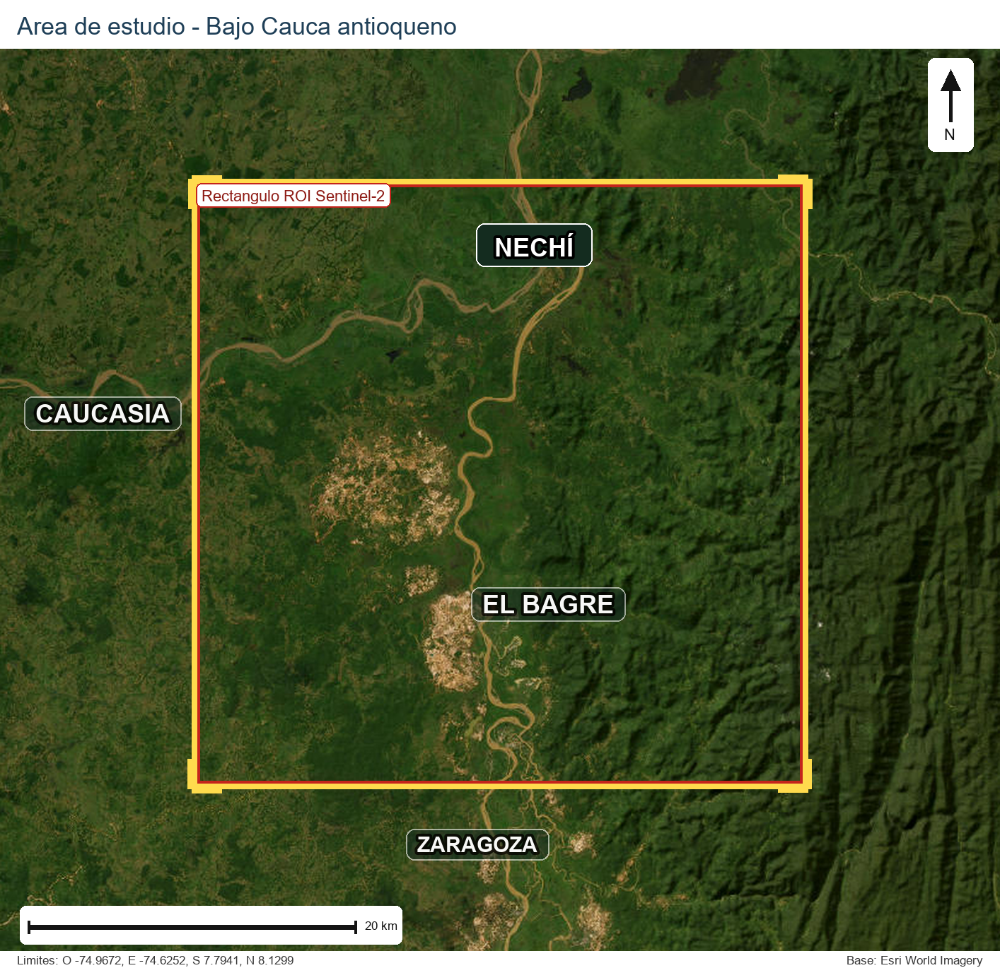

<style>
body {
  text-align: justify;
  line-height: 1.7;
}

h1, h2, h3 {
  font-weight: 700;
}

h1 {
  border-bottom: 3px solid #2c7fb8;
  padding-bottom: 0.3rem;
  margin-top: 1.2rem;
}

h2 {
  color: #1f5f8b;
  margin-top: 1.5rem;
}

h3 {
  color: #2c7a7b;
}

.caja-suave {
  background: #f7fbff;
  border-left: 6px solid #2c7fb8;
  padding: 1rem 1.2rem;
  border-radius: 8px;
  margin: 1rem 0;
}

.caja-verde {
  background: #f3fbf6;
  border-left: 6px solid #2ca25f;
  padding: 1rem 1.2rem;
  border-radius: 8px;
  margin: 1rem 0;
}

.caja-morada {
  background: #faf7ff;
  border-left: 6px solid #7a4ebf;
  padding: 1rem 1.2rem;
  border-radius: 8px;
  margin: 1rem 0;
}

.caja-alerta {
  background: #fff8ef;
  border-left: 6px solid #d97706;
  padding: 1rem 1.2rem;
  border-radius: 8px;
  margin: 1rem 0;
}

pre, code {
  border-radius: 8px;
}

pre code {
  font-size: 0.95rem;
}

table {
  width: 100%;
  margin: 1rem 0;
}

th {
  background-color: #eaf4fb !important;
}

blockquote {
  border-left: 5px solid #2c7fb8;
  background: #f8fbfd;
  padding: 0.8rem 1rem;
  border-radius: 6px;
}
</style>

# Resumen

Este proyecto construye un flujo reproducible para identificar coberturas
asociadas a mineria de oro de aluvion en el Bajo Cauca antioqueno usando
imagenes Sentinel-2, puntos etiquetados y modelos Random Forest. La solucion
esta organizada con Kedro: cada etapa se declara como pipeline, cada pipeline
contiene nodos pequenos, y las entradas/salidas se administran con catalogos y
parametros YAML.

El analisis incluye dos aproximaciones complementarias. La primera es una
clasificacion binaria orientada a separar **Mineria** y **No Mineria**. La
segunda es una clasificacion multiclase que diferencia **Bosque Natural**,
**Cuerpos de Agua**, **Mineria**, **Nubes**, **Suelo Desnudo** y
**Vegetacion**. Esta combinacion permite evaluar el problema de forma mas
didactica: el modelo binario responde donde hay mineria, mientras que el
modelo multiclase ayuda a entender con que coberturas se confunde.

::: {.caja-alerta}
**Alcance acotado.** El proyecto usa Sentinel-2 como fuente satelital abierta,
Google Earth Engine para preparar los productos y Random Forest como modelo
supervisado. No se incluyen sensores comerciales ni aprendizaje profundo,
porque el objetivo principal es que el flujo sea explicable, ejecutable y
reproducible en un contexto academico.
:::

# Introduccion y Justificacion

La minería de oro de aluvión es una de las formas de extracción de minerales más controvertidas en el mundo, debido a sus significativos impactos sociales y medioambientales. Esta actividad, que se desarrolla principalmente en los cauces de los ríos, ha generado una preocupación histórica por la pérdida de ecosistemas, la degradación de las quebradas y los ríos, así como por las tensiones sociales derivadas del uso inapropiado de los recursos naturales.

En este contexto, la geomática, como disciplina que integra los Sistemas de Información Geográfica (SIG), la programación, la teledetección y el análisis de información geoespacial, se ha consolidado como un campo fundamental para la gestión y monitoreo de los recursos naturales.

En el caso de la minería de oro de aluvión, su identificación mediante imágenes satelitales presenta múltiples desafíos técnicos, entre los que destacan la variabilidad espectral de los materiales, la heterogeneidad del paisaje intervenido y la dinámica espacio-temporal de las áreas afectadas. Desde una perspectiva geoespacial, esta actividad se caracteriza por una distribución dispersa y altamente dinámica, asociada principalmente a redes hidrográficas y zonas aluviales, lo que dificulta su delimitación precisa y su monitoreo continuo en el territorio. Estas características hacen necesario el uso de metodologías avanzadas que permitan automatizar su detección con mayor precisión y rapidez.

Diversos estudios han evidenciado que esta actividad genera impactos severos, como la contaminación por mercurio y cianuro, la pérdida de cobertura vegetal y la degradación de suelos [@perez2016impactos; @bansah2022guns; @cardona2022highly]. Estas afectaciones comprometen no solo los ecosistemas, sino también las condiciones de vida de las comunidades locales [@velez2014extractivism].

A nivel institucional, entidades como la UNODC han incorporado el uso de imágenes satelitales para el monitoreo de esta actividad [@unodc2022evidencias]. No obstante, estos análisis presentan limitaciones en términos de actualización temporal, ya que los reportes se publican con desfases significativos, lo que reduce la capacidad de respuesta oportuna frente a la dinámica de expansión de la minería.

Ahora bien, pese al evidente potencial de las herramientas de observación de la Tierra para detectar, mapear y monitorear los impactos de esta actividad extractiva, su aplicación sigue siendo limitada en Colombia [@ibrahim2020small]. En este contexto, la ausencia de sistemas automatizados de vigilancia limita la generación de alertas tempranas y dificulta la intervención oportuna en zonas afectadas [@rincon2024fracaso].

En este sentido, los modelos de inteligencia artificial y aprendizaje automático emergen como una alternativa prometedora, al permitir la identificación y el monitoreo de patrones espaciales y temporales asociados a la minería de oro de aluvión con mayor precisión y escalabilidad [@nursamsi2024feasibility].

Por tanto, este proyecto propone integrar técnicas de teledetección y aprendizaje automático para la identificación de minería de oro de aluvión mediante imágenes satelitales, a través del desarrollo de un flujo de trabajo reproducible basado en Kedro. Este enfoque permitirá estructurar de manera sistemática las etapas de adquisición, procesamiento y análisis de datos, garantizando la trazabilidad, escalabilidad y reproducibilidad del proceso, así como el análisis de su distribución espacial y evolución temporal en la zona de estudio.

# Estado del Arte / Revision Bibliografica

El estudio de la minería de oro de aluvión desde una perspectiva geoespacial ha cobrado creciente interés en la comunidad científica, particularmente con el avance de las tecnologías de observación de la Tierra, los Sistemas de Información Geográfica (SIG) y el desarrollo de herramientas de programación orientadas al análisis de datos espaciales. En este contexto, la literatura reciente ha abordado la identificación, monitoreo y análisis de esta actividad mediante el uso de imágenes satelitales, integrando enfoques que combinan el procesamiento digital de imágenes, el análisis multitemporal y la implementación de algoritmos de aprendizaje automático en entornos computacionales. Estas aproximaciones han permitido no solo mejorar la comprensión de la dinámica espacial de la minería, sino también avanzar hacia metodologías automatizadas, reproducibles y escalables para su detección en diferentes contextos geográficos.

En el estudio de [@nursamsi2024feasibility] se destaca la utilización de imágenes SAR (Radar de Apertura Sintética), combinadas con imágenes multiespectrales y modelos de aprendizaje automatizado en el aplicativo de Google Earth Engine, para identificar y mapear minería artesanal en la región minera de Kalimantan, Indonesia. Por su parte, [@ngom2022recent] identificaron y cuantificaron la tasa de expansión de las áreas afectadas por la minería en el río Bandama, Costa de Marfil, durante el período 2018-2021, mediante la aplicación de algoritmos de aprendizaje automático sobre imágenes Sentinel-2. Ambos estudios evidencian el potencial de la integración entre sensores remotos y algoritmos como Máquinas de Vectores de Soporte (SVM) y Random Forest (RF) para el monitoreo eficiente de la minería en distintos contextos geográficos.

Por otro lado, [@kumar2023comparative] abordaron el monitoreo continuo de áreas con actividad minera mediante el uso de imágenes satelitales y técnicas avanzadas de procesamiento. En su estudio, destacan la aplicación de algoritmos de aprendizaje profundo para clasificar coberturas del suelo en zonas mineras, utilizando imágenes fusionadas provenientes de sensores LISS-IV, Landsat-8 y Sentinel-2A. Esta integración multifuente permitió mejorar la resolución espacial y espectral, incrementando la exactitud en la detección y seguimiento de los cambios inducidos por la actividad minera.

De manera complementaria, [@saputra2025multimodal] exploraron la aplicación de técnicas de segmentación semántica empleando imágenes multiespectrales para identificar zonas mineras en diferentes regiones del mundo. Estos enfoques evidencian un avance hacia metodologías más automatizadas, basadas en modelos de aprendizaje profundo como redes neuronales convolucionales, que permiten mejorar la clasificación y el monitoreo de coberturas asociadas a la minería.

En esta misma línea, [@vanrensburg2022sar] integraron imágenes Sentinel-1 con datos ópticos mediante análisis multitemporal y la implementación de algoritmos como k-vecinos más cercanos (KNN), árboles de decisión (DT), Random Forest (RF) y SVM, para identificar actividades de minería artesanal en zonas tropicales de Ghana. Este tipo de aproximaciones permite analizar la expansión progresiva de la minería, facilitando el seguimiento de los cambios espaciales en el territorio.

A nivel nacional, se han logrado avances importantes en la identificación y clasificación de la minería de oro de aluvión mediante el uso de imágenes satelitales y diferentes enfoques metodológicos. Un estudio destacado es el realizado por la UNODC [@unodc2022evidencias], el cual empleó propiedades pictoricomorfológicas como la forma, el tamaño, la textura y la asociación espacial para detectar explotación de oro de aluvión en Colombia.

Por su parte, Castellanos [@castellanos2016tesis] y Castellanos et al. [@castellanos2017detection] desarrollaron una metodología aplicada al Bajo Cauca antioqueño, basada en la fusión de imágenes satelitales, el uso de índices espectrales y la clasificación orientada a objetos, con el fin de discriminar áreas mineras y no mineras. Su propuesta incluye etapas como la selección de muestras representativas, el análisis del índice de Fisher y la evaluación del error, logrando resultados robustos en la identificación de zonas mineras a cielo abierto.

Si bien estos estudios no incorporan de manera explícita algoritmos avanzados de aprendizaje automatizado, constituyen un referente metodológico fundamental en el país y un punto de partida para la implementación de enfoques más robustos. Además, aportan al entendimiento de las propiedades espectrales y espaciales asociadas a la minería de oro de aluvión.

En la misma línea, otros estudios nacionales aportan enfoques complementarios [@ibrahim2020small] aplicaron técnicas de detección de cambios mediante imágenes Sentinel-2 en los municipios de El Bagre y Zaragoza, empleando métodos de clasificación supervisada para identificar transformaciones del paisaje asociadas a la minería. Por su parte, [@sandoval2022metodologia] utilizaron imágenes radar Sentinel-1 en la región del Chocó para detectar minería en condiciones de alta nubosidad, mientras que [@herrera2025temporal] analizaron cambios de cobertura del suelo entre 1985 y 2020 mediante imágenes Landsat y clasificación no supervisada en el municipio de Ayapel.

A pesar de los avances identificados, gran parte de los estudios se han enfocado en la aplicación de técnicas específicas de clasificación o en análisis multitemporales, sin integrar de manera estructurada y reproducible todo el flujo de trabajo, desde la adquisición de datos hasta la implementación de modelos. En este sentido, se identifica una oportunidad de investigación en la integración de técnicas de teledetección y aprendizaje automático dentro de entornos reproducibles que permitan automatizar y sistematizar el proceso de identificación de minería de oro de aluvión en contextos como el colombiano.


# Objetivos

## Pregunta guia

> Como construir un flujo reproducible para clasificar zonas asociadas a
> mineria de oro de aluvion usando imagenes Sentinel-2, variables espectrales y
> modelos Random Forest?

## Objetivo general

::: {.caja-verde}
Desarrollar un flujo de trabajo reproducible para clasificar coberturas
asociadas a mineria de oro de aluvion a partir de Sentinel-2, indices
espectrales y Random Forest implementado en Python con Kedro.
:::

## Objetivos especificos

::: {.caja-verde}
1. Automatizar la descarga, preparacion y transformacion de imagenes Sentinel-2
en bandas e indices espectrales utiles para clasificacion supervisada.

2. Entrenar, aplicar y validar modelos Random Forest binario y multiclase,
generando mapas tematicos, metricas, matrices de confusion y productos de
postprocesamiento espacial.
:::

# Area de Estudio

El area operativa se ubica en el Bajo Cauca antioqueno, una subregion con
presencia historica de mineria aurifera de aluvion y transformaciones
territoriales asociadas a cauces y terrazas aluviales. En la implementacion,
la zona de consulta se define con un poligono parametrizado para Google Earth
Engine, aproximadamente dentro de los siguientes limites:

| Limite | Valor |
|---|---:|
| Longitud minima | -74.96723392 |
| Longitud maxima | -74.62519767 |
| Latitud minima | 7.79405091 |
| Latitud maxima | 8.12991298 |

{#fig-area-estudio fig-align="center" width="90%"}

# Fuentes de Datos

Las fuentes de datos del proyecto se organizaron para que cada insumo tuviera
una funcion clara dentro del flujo: imagen satelital, variable topografica,
puntos de entrenamiento, parametros de ejecucion y productos de salida. No se
usaron datasets de Kaggle ni catalogos comerciales; la prioridad fue trabajar
con fuentes abiertas, APIs reproducibles y datos locales versionables.

## Datasets, APIs y catalogos usados

| Fuente | Tipo | Uso en el proyecto | Forma de acceso | Reproducibilidad |
|---|---|---|---|---|
| `COPERNICUS/S2_SR_HARMONIZED` | Coleccion satelital en Google Earth Engine | Imagen Sentinel-2 Surface Reflectance para bandas espectrales e indices | API de Google Earth Engine | Requiere cuenta GEE y parametros versionados |
| `USGS/SRTMGL1_003` | Modelo digital de elevacion en Google Earth Engine | Elevacion (`DEM`) y pendiente (`SLOPE`) como variables topograficas | API de Google Earth Engine | Requiere cuenta GEE; se descarga y alinea localmente |
| `Datos_Entrenamiento.shp` | Vector local | Puntos etiquetados para entrenamiento, prueba y validacion espacial | Archivo local en `data/01_raw` | Insumo versionable dentro del repositorio |
| Google Drive | Servicio intermedio | Recepcion del GeoTIFF exportado desde Earth Engine | API de Drive mediante credenciales del usuario | Regenerable, pero depende de autenticacion |
| YAML de parametros | Configuracion reproducible | Fechas, ROI, bandas, modelos, umbrales, colores y rutas | `conf/base/parameters` | Versionado y editable sin cambiar codigo |
| Catalogos Kedro | Declaracion de datasets | Entradas, salidas, tipos de archivo y rutas usadas por los pipelines | `conf/base/catalog` | Versionado como parte del proyecto |
| `data/08_reporting` | Carpeta de resultados | Figuras, metricas y metadatos JSON por pipeline | Salidas locales generadas por Kedro | Regenerable al correr los pipelines |

Google Earth Engine se uso como plataforma de consulta y preparacion inicial
porque permite acceder a colecciones satelitales y productos topograficos sin
descargar manualmente escenas individuales. En este proyecto, Earth Engine no
se uso como una caja negra: las fechas, la geometria de interes, las bandas,
las mascaras de nubes y el CRS de trabajo se definieron en archivos YAML. De
esta forma, el flujo puede repetirse modificando parametros y no reescribiendo
codigo.

La seleccion final de bandas se concentro en las longitudes de onda mas utiles
para diferenciar vegetacion, agua, suelo desnudo, superficies alteradas y
respuesta SWIR. La tabla resume las bandas Sentinel-2 que entran al flujo de
clasificacion.

| Banda usada | Longitud de onda (nm) | Resolucion espacial (m) |
|---|---:|---:|
| Banda 2 - azul | 445 - 520 | 10 |
| Banda 3 - verde | 540 - 570 | 10 |
| Banda 4 - rojo | 650 - 680 | 10 |
| Banda 5 - borde rojo de vegetacion (Red Edge) | 690 - 710 | 20 |
| Banda 6 - borde rojo de vegetacion (Red Edge) | 730 - 750 | 20 |
| Banda 7 - borde rojo de vegetacion (Red Edge) | 770 - 790 | 20 |
| Banda 8 - infrarrojo cercano (NIR) | 780 - 900 | 10 |
| Banda 8A - borde rojo de vegetacion (Red Edge) | 850 - 870 | 20 |
| Banda 11 - SWIR | 1560 - 1650 | 20 |

Fuente: adaptado de NASA [@nasa_sentinel2_msi2025].

El uso de Google Drive fue una decision practica. La descarga directa de
imagenes grandes desde Earth Engine tiene limites de tamano; por eso, el
pipeline exporta primero el compuesto Sentinel-2 a Drive y luego lo descarga
localmente. Una vez en disco, las bandas se separan como GeoTIFF individuales
en `data/04_feature/sentinel2_bands`, lo que permite que los siguientes
pipelines trabajen con archivos locales y no dependan continuamente de la nube.

## Variables derivadas de los datos

La configuracion base trabaja con Sentinel-2, indices espectrales y dos
variables topograficas. Las bandas `B1` y `B9` se excluyeron porque tienen una
funcion atmosferica y resolucion nativa de 60 m; para este analisis aportaban
menos informacion tematica que las bandas visibles, NIR, Red Edge y SWIR. La
banda `B12` se excluyo despues del control de calidad porque presentaba una
proporcion alta de valores sin datos en la zona de estudio; por la misma razon
tambien se excluyo `MSWI`, ya que depende de esa banda. Esta decision evita que
la prediccion raster quede reducida a una franja pequena del area de estudio.

```yaml
model_features: [B2, B3, B4, B5, B6, B7, B8, B8A, B11,
                 NDVI, MSAVI, NDWI, BSI, MBSI, NDSI, NDBI, DEM, SLOPE]
excluded_after_quality_control: [B1, B9, B12, MSWI]
target_crs: EPSG:9377
```

Los indices espectrales se incluyeron porque resumen procesos fisicos
relevantes para la clasificacion: vigor de vegetacion, humedad, suelo desnudo,
superficies alteradas y contraste entre coberturas. Las variables topograficas
se incluyeron como apoyo contextual, especialmente para diferenciar zonas
aluviales, planicies, laderas y superficies intervenidas.

La seleccion de indices se hizo buscando variables interpretables y coherentes
con las bandas conservadas en el proyecto. El cuadro muestra que se calcula,
como se calcula y por que se incluye dentro del flujo. No se incluye `MSWI`,
aunque aparece en algunas propuestas para residuos mineros, porque depende de
`B12` y esa banda fue excluida despues del control de calidad.

| Nombre | Acronimo | Formula | Fuente | Razon fundamental |
|---|---|---|---|---|
| Indice de vegetacion de diferencia normalizada | NDVI | $\frac{B8 - B4}{B8 + B4}$ | [@ngom2022recent; @ngom2020mapping; @ibrahim2020small; @ayiwouo2023assessment] | Detectar perdida o reduccion de cobertura vegetal presente en zonas mineras. |
| Indice de Vegetacion Ajustado al Suelo Modificado | MSAVI | $\frac{2B8 + 1 - \sqrt{(2B8 + 1)^2 - 8(B8 - B4)}}{2}$ | [@nyamekye2021mapping] | Aumentar el contraste entre vegetacion y areas mineras a cielo abierto. |
| Indice de agua de diferencia normalizada | NDWI | $\frac{B3 - B8}{B3 + B8}$ | [@nursamsi2024feasibility; @ngom2020mapping; @ngom2022recent] | Manejar la humedad del suelo y cuerpos de agua presentes en zonas mineras. |
| Indice de suelo desnudo | BSI | $\frac{(B11 + B4) - (B8 + B2)}{(B11 + B4) + (B8 + B2)}$ | [@ngom2020mapping; @ayiwouo2023assessment; @nursamsi2024feasibility; @ayouba2025assessment] | Identificar zonas de suelo desnudo como proceso previo a la aparicion de zonas mineras. |
| Indice de Suelo Desnudo Modificado | MBSI | $\frac{B11 - B4}{B11 + B4}$ | [@ngom2020mapping; @ayiwouo2023assessment; @nursamsi2024feasibility; @ayouba2025assessment] | Reforzar la separacion entre superficies expuestas, vegetacion y zonas intervenidas. |
| Indice de Suelo de Diferencia Normalizada | NDSI | $\frac{B11 - B3}{B11 + B3}$ | [@nursamsi2024feasibility] | Aumentar el contraste entre la vegetacion y las areas con mineria. |
| Indice de estructura construida | NDBI | $\frac{B11 - B8}{B11 + B8}$ | [@ngom2022recent] | Ayudar a distinguir entre zonas urbanas, suelo desnudo y mineria. |

## Librerias principales usadas

El proyecto se implemento en Python y se apoyo en librerias geoespaciales,
estadisticas y de aprendizaje automatico. La tabla resume su papel dentro del
flujo:

| Grupo | Librerias | Funcion en el proyecto |
|---|---|---|
| Orquestacion y reproducibilidad | `kedro`, `kedro-datasets`, `kedro-viz`, `PyYAML` | Organizar pipelines, nodos, catalogos, parametros y visualizacion del flujo |
| Google Earth Engine y web | `earthengine-api`, `requests` | Autenticacion, consulta de colecciones, exportacion y descarga de productos |
| Datos tabulares y numericos | `pandas`, `numpy` | Limpieza de tablas, manejo de matrices, calculo de metricas y organizacion de features |
| SIG y raster | `rasterio`, `rioxarray`, `xarray`, `geopandas`, `shapely`, `pyproj` | Lectura/escritura de GeoTIFF, reproyeccion, geometria vectorial y manejo de CRS |
| Modelado | `scikit-learn`, `joblib` | Entrenamiento Random Forest, prediccion, metricas y serializacion de modelos |
| Visualizacion | `matplotlib`, `seaborn`, `contextily` | Mapas, matrices de confusion, importancia de variables y graficas exploratorias |
| Pruebas | `pytest` | Verificacion automatica de nodos, pipelines y funciones principales |

## Que es Kedro y como se uso

Kedro es un framework open source de Python para construir pipelines de datos
y ciencia de datos con buenas practicas de ingenieria de software. Su enfoque
propone organizar el codigo en funciones pequenas, conectarlas mediante
pipelines, declarar entradas y salidas en un catalogo de datos y mantener los
parametros separados del codigo fuente. La pagina oficial de Kedro lo describe
como una caja de herramientas para pipelines reproducibles y listos para
produccion, con conceptos como Data Catalog, abstraccion de pipelines,
plantilla de proyecto y visualizacion del flujo [@kedro2026].

En este proyecto, Kedro cumplio cuatro funciones metodologicas:

1. **Separar responsabilidades.** Cada pipeline resuelve una etapa concreta:
descarga Sentinel-2, topografia, indices, preparacion de puntos, extraccion de
features, entrenamiento, prediccion, validacion y postprocesamiento.

2. **Declarar entradas y salidas.** Los catalogos YAML indican donde vive cada
dataset, que tipo de archivo es y que nodo lo produce o consume. Esto evita
rutas ocultas dentro del codigo.

3. **Controlar parametros.** Las fechas, bandas, ROI, umbrales, colores,
salidas y configuraciones de modelo estan en `conf/base/parameters`. Cambiar
un experimento no exige modificar la logica del programa.

4. **Facilitar reproducibilidad.** Cualquier persona puede ejecutar el mismo
flujo con comandos `kedro run --pipeline ...`, revisar el orden de ejecucion y
regenerar las salidas desde los insumos declarados.

El flujo completo se interpreta entonces como una cadena reproducible de
geoprocesamiento: los nodos son funciones de Python, los pipelines son la
secuencia logica de esas funciones, los catalogos definen los datasets y los
parametros documentan las decisiones tecnicas. Esta estructura es especialmente
util para un proyecto de geomatica, porque permite auditar como se paso de la
imagen satelital original a los mapas tematicos finales.

# Metodologia y Codigo

::: {.caja-morada}
La idea metodologica es simple: cada pipeline debe hacer una parte pequena y
verificable. Por eso el informe se organiza igual que el codigo: primero se
presenta el comando de ejecucion, luego el diagrama, despues el fragmento de
codigo central y finalmente el resultado generado.

Para no duplicar todo el repositorio dentro del informe, en cada pipeline se
incluye completo el archivo `pipeline.py`. Ese archivo muestra la arquitectura
Kedro: imports, funcion `create_pipeline()`, orden de ejecucion, entradas,
salidas y nombre de cada nodo. Si se quiere profundizar en la logica interna,
cada seccion indica los nodos que deben revisarse en la carpeta `nodes/` del
pipeline correspondiente.
:::

## Estructura del proyecto

```text
conf/
  base/
    catalog/        # Entradas y salidas declaradas para Kedro
    parameters/     # Parametros reproducibles por pipeline
data/
  01_raw/           # Insumos fuente
  04_feature/       # Bandas Sentinel-2 e indices en GeoTIFF
  05_model_input/   # Tablas de entrenamiento y prueba
  06_models/        # Modelos entrenados
  07_model_output/  # Mapas raster, CSV y vectores derivados
  08_reporting/     # Figuras, metricas y metadatos
src/
  centromonitoreo_mineria/
    pipeline_registry.py
    pipelines/
tests/
```

## Registro general de pipelines

El archivo `pipeline_registry.py` es el indice del proyecto. Alli Kedro conoce
que pipelines existen y con que nombre se ejecutan:

```python
def register_pipelines() -> dict[str, Pipeline]:
    return {
        "build_topographic_features": build_topographic_features_pipeline(),
        "download_sentinel2": download_sentinel2_pipeline(),
        "sentinel2_spectral_indices": sentinel2_spectral_indices_pipeline(),
        "prepare_training_data": prepare_training_data_pipeline(),
        "extract_sentinel2_training_features": extract_sentinel2_training_features_pipeline(),
        "train_mining_binary_rf": train_mining_binary_rf_pipeline(),
        "predict_mining_binary_map": predict_mining_binary_map_pipeline(),
        "postprocess_mining_binary_map": postprocess_mining_binary_map_pipeline(),
        "validate_mining_binary_map": validate_mining_binary_map_pipeline(),
        "validate_postprocessed_mining_map": validate_postprocessed_mining_map_pipeline(),
        "train_mining_multiclass_rf": train_mining_multiclass_rf_pipeline(),
        "predict_mining_multiclass_map": predict_mining_multiclass_map_pipeline(),
        "validate_mining_multiclass_map": validate_mining_multiclass_map_pipeline(),
        "postprocess_mining_multiclass_map": postprocess_mining_multiclass_map_pipeline(),
        "validate_postprocessed_mining_multiclass_map": validate_postprocessed_mining_multiclass_map_pipeline(),
    }
```

## Flujo completo

```{mermaid}
flowchart TD
  A[Sentinel-2 en GEE] --> B[download_sentinel2]
  B --> T[build_topographic_features]
  B --> C[sentinel2_spectral_indices]
  D[Puntos etiquetados] --> E[prepare_training_data]
  C --> F[extract_sentinel2_training_features]
  T --> F
  E --> F
  F --> H[train_mining_binary_rf]
  H --> I[predict_mining_binary_map]
  T --> I
  I --> J[postprocess_mining_binary_map]
  I --> K[validate_mining_binary_map]
  J --> L[validate_postprocessed_mining_map]
  F --> M[train_mining_multiclass_rf]
  M --> N[predict_mining_multiclass_map]
  T --> N
  N --> O[validate_mining_multiclass_map]
  N --> P[postprocess_mining_multiclass_map]
  P --> Q[validate_postprocessed_mining_multiclass_map]
```

## Pipeline 1: descarga de Sentinel-2

**Comando**

```powershell
kedro run --pipeline download_sentinel2
```

**Codigo completo de `pipeline.py`**

```python
from kedro.pipeline import Pipeline, node
from centromonitoreo_mineria.pipelines.download_sentinel2.nodes import (
    build_sentinel2_download_assets,
    build_sentinel2_download_metadata,
    build_sentinel2_download_visualizations,
    download_sentinel2_drive_export_to_local,
    export_sentinel2_download_to_drive,
    validate_sentinel2_download_config,
)


def create_pipeline(**kwargs) -> Pipeline:
    """Creates the Kedro pipeline for the Sentinel-2 download process."""
    return Pipeline(
        [
            node(
                func=validate_sentinel2_download_config,
                inputs=["params:gee", "params:sentinel2_download"],
                outputs="sentinel2_download_config",
                name="validate_sentinel2_download_config_node",
            ),
            node(
                func=build_sentinel2_download_assets,
                inputs="sentinel2_download_config",
                outputs="sentinel2_download_assets",
                name="build_sentinel2_download_assets_node",
            ),
            node(
                func=export_sentinel2_download_to_drive,
                inputs=["sentinel2_download_assets", "sentinel2_download_config"],
                outputs="sentinel2_drive_export_metadata",
                name="export_sentinel2_download_to_drive_node",
            ),
            node(
                func=build_sentinel2_download_metadata,
                inputs=[
                    "sentinel2_download_assets",
                    "sentinel2_drive_export_metadata",
                    "sentinel2_download_config",
                ],
                outputs="sentinel2_download_metadata",
                name="build_sentinel2_download_metadata_node",
            ),
            node(
                func=download_sentinel2_drive_export_to_local,
                inputs=["sentinel2_drive_export_metadata", "sentinel2_download_config"],
                outputs="sentinel2_local_download_metadata",
                name="download_sentinel2_drive_export_to_local_node",
            ),
            node(
                func=build_sentinel2_download_visualizations,
                inputs=["sentinel2_local_download_metadata", "sentinel2_download_config"],
                outputs="sentinel2_download_visualizations_metadata",
                name="build_sentinel2_download_visualizations_node",
            ),
        ]
    )
```

Para profundizar en la logica interna, revisar los nodos
`validate_sentinel2_download_config_node`,
`build_sentinel2_download_assets_node`,
`export_sentinel2_download_to_drive_node`,
`build_sentinel2_download_metadata_node`,
`download_sentinel2_drive_export_to_local_node` y
`build_sentinel2_download_visualizations_node`.

```{mermaid}
flowchart LR
  p["params:gee + params:sentinel2_download"]:::data --> v("validar configuracion"):::node
  v --> a("construir imagen Sentinel-2"):::node
  a --> e("exportar GeoTIFF a Drive"):::node
  e --> d("descargar y separar bandas"):::node
  d --> r["data/04_feature/sentinel2_bands"]:::data
  d --> m("generar RGB y falso color"):::node
  m --> o["data/08_reporting/sentinel2_download_visualizations"]:::data
  classDef data fill:#ffffff,stroke:#333,stroke-dasharray:5 5;
  classDef node fill:#b7dce8,stroke:#111;
```

El primer intento de descarga directa desde Earth Engine superaba el limite de
tamano de la API. Por eso el flujo final exporta primero a Google Drive y luego
descarga localmente el GeoTIFF, reproyectandolo a `EPSG:9377` y separando las
bandas.

```python
# Funcion para descargar desde Drive el GeoTIFF exportado por Earth Engine.
def download_sentinel2_drive_export_to_local(drive_export_metadata, config):
    params = config["sentinel2_download"]
    output_dir = Path(params["local_download"]["output_dir"])
    source_path = output_dir / f"{drive_export_metadata['file_name_prefix']}.tif"

    _download_from_drive(drive_export_metadata, source_path)
    _reproject_file(source_path, params["local_download"])
    downloaded_files = _split_bands(source_path, output_dir, params, params["local_download"])
    return {"source_path": source_path.as_posix(), "downloaded_files": downloaded_files}
```

**Resultados**

{#fig-true-color fig-align="center" width="90%"}

{#fig-true-color-background fig-align="center" width="90%"}

{#fig-false-color fig-align="center" width="90%"}

{#fig-bands-grid fig-align="center" width="95%"}

La salida visual permite revisar si la imagen cubre correctamente el area de
estudio, si el CRS quedo consistente y si existen zonas NoData. La reproyeccion
a `EPSG:9377` se usa porque el proyecto trabaja en Colombia y requiere medir
areas en metros.

## Pipeline 2: variables topograficas

**Comando**

```powershell
kedro run --pipeline build_topographic_features
```

**Codigo completo de `pipeline.py`**

```python
from kedro.pipeline import Pipeline, node

from centromonitoreo_mineria.pipelines.build_topographic_features.nodes import (
    build_topographic_features,
    plot_topographic_feature_maps,
    validate_topographic_features_config,
)


def create_pipeline(**kwargs) -> Pipeline:
    """Creates the Kedro pipeline for topographic features."""
    return Pipeline(
        [
            node(
                func=validate_topographic_features_config,
                inputs=[
                    "params:gee",
                    "params:sentinel2_download",
                    "params:topographic_features",
                ],
                outputs="topographic_features_config",
                name="validate_topographic_features_config_node",
            ),
            node(
                func=build_topographic_features,
                inputs="topographic_features_config",
                outputs="topographic_features_metadata",
                name="build_topographic_features_node",
            ),
            node(
                func=plot_topographic_feature_maps,
                inputs=["topographic_features_metadata", "topographic_features_config"],
                outputs="topographic_feature_maps_metadata",
                name="plot_topographic_feature_maps_node",
            ),
        ]
    )
```

Para profundizar en la logica interna, revisar los nodos
`validate_topographic_features_config_node`, `build_topographic_features_node`
y `plot_topographic_feature_maps_node`.

```{mermaid}
flowchart LR
  p["params:topographic_features"]:::data --> v("validar configuracion"):::node
  v --> d("descargar DEM y pendiente"):::node
  b["Sentinel2_B2_Masked.tif"]:::data --> a("alinear a grilla Sentinel-2"):::node
  d --> a
  a --> dem["Topography_DEM.tif"]:::data
  a --> slope["Topography_SLOPE.tif"]:::data
  a --> meta["metadata JSON"]:::data
  classDef data fill:#ffffff,stroke:#333,stroke-dasharray:5 5;
  classDef node fill:#b7dce8,stroke:#111;
```

Este paso agrega dos variables sencillas: elevacion (`DEM`) y pendiente
(`SLOPE`). No reemplazan la informacion espectral; aportan contexto del
relieve. En mineria aluvial, la forma del terreno puede ayudar a separar
cauces, planicies, laderas y superficies alteradas que a veces se parecen en
las bandas Sentinel-2.

```python
# Funcion para construir una imagen Earth Engine con elevacion y pendiente.
def build_topographic_image(params):
    dem = ee.Image(params["dem_asset"]).select("elevation").rename("DEM")
    slope = ee.Terrain.slope(dem).rename("SLOPE")
    return dem.addBands(slope)
```

Los GeoTIFF resultantes quedan en `data/04_feature/sentinel2_bands` para que
las predicciones raster usen la misma grilla, el mismo CRS y la misma extension
que las bandas Sentinel-2.

**Resultados**

{#fig-topography-dem fig-align="center" width="90%"}

{#fig-topography-slope fig-align="center" width="90%"}

Estos mapas en color permiten revisar el contexto fisico de la zona de estudio.
El DEM resalta la transicion entre planicies aluviales y zonas de mayor
elevacion, mientras que la pendiente ayuda a ubicar laderas, bordes de valle y
superficies mas estables o mas abruptas.

## Pipeline 3: indices espectrales Sentinel-2

**Comando**

```powershell
kedro run --pipeline sentinel2_spectral_indices
```

**Codigo completo de `pipeline.py`**

```python
from kedro.pipeline import Pipeline, node
from centromonitoreo_mineria.pipelines.sentinel2_spectral_indices.nodes import (
    build_sentinel2_spectral_indices_assets,
    build_sentinel2_spectral_indices_metadata,
    export_sentinel2_spectral_index_maps,
    export_sentinel2_spectral_index_tifs,
    validate_sentinel2_spectral_indices_config,
)


def create_pipeline(**kwargs) -> Pipeline:
    """Creates the Kedro pipeline for Sentinel-2 spectral indices."""
    return Pipeline(
        [
            node(
                func=validate_sentinel2_spectral_indices_config,
                inputs=["params:gee", "params:sentinel2_spectral_indices"],
                outputs="sentinel2_spectral_indices_config",
                name="validate_sentinel2_spectral_indices_config_node",
            ),
            node(
                func=build_sentinel2_spectral_indices_assets,
                inputs="sentinel2_spectral_indices_config",
                outputs="sentinel2_spectral_indices_assets",
                name="build_sentinel2_spectral_indices_assets_node",
            ),
            node(
                func=export_sentinel2_spectral_index_maps,
                inputs=[
                    "sentinel2_spectral_indices_assets",
                    "sentinel2_spectral_indices_config",
                ],
                outputs="sentinel2_spectral_indices_maps_metadata",
                name="export_sentinel2_spectral_index_maps_node",
            ),
            node(
                func=export_sentinel2_spectral_index_tifs,
                inputs="sentinel2_spectral_indices_config",
                outputs="sentinel2_spectral_indices_tifs_metadata",
                name="export_sentinel2_spectral_index_tifs_node",
            ),
            node(
                func=build_sentinel2_spectral_indices_metadata,
                inputs=[
                    "sentinel2_spectral_indices_assets",
                    "sentinel2_spectral_indices_maps_metadata",
                    "sentinel2_spectral_indices_tifs_metadata",
                    "sentinel2_spectral_indices_config",
                ],
                outputs="sentinel2_spectral_indices_metadata",
                name="build_sentinel2_spectral_indices_metadata_node",
            ),
        ]
    )
```

Para profundizar en la logica interna, revisar los nodos
`validate_sentinel2_spectral_indices_config_node`,
`build_sentinel2_spectral_indices_assets_node`,
`export_sentinel2_spectral_index_maps_node`,
`export_sentinel2_spectral_index_tifs_node` y
`build_sentinel2_spectral_indices_metadata_node`.

```{mermaid}
flowchart LR
  b["Bandas Sentinel-2"]:::data --> c("calcular indices espectrales"):::node
  c --> t["GeoTIFF por indice"]:::data
  c --> p("exportar mapas PNG"):::node
  p --> o["panel e indices individuales"]:::data
  classDef data fill:#ffffff,stroke:#333,stroke-dasharray:5 5;
  classDef node fill:#b7dce8,stroke:#111;
```

Los indices se calculan para representar los procesos descritos en la seccion
de variables derivadas: vigor de vegetacion, humedad, suelo desnudo y
superficies alteradas. En esta etapa, el pipeline convierte esas formulas en
GeoTIFF locales y mapas PNG para revisar su comportamiento espacial.

```python
# Funcion para calcular indices espectrales con operaciones seguras.
def add_sentinel2_spectral_indices(image):
    ndvi = image.normalizedDifference(["B8", "B4"]).rename("NDVI")
    ndwi = image.normalizedDifference(["B3", "B8"]).rename("NDWI")
    ndbi = image.normalizedDifference(["B11", "B8"]).rename("NDBI")
    bsi = image.expression(
        "((swir + red) - (nir + blue)) / ((swir + red) + (nir + blue))",
        {"swir": image.select("B11"), "red": image.select("B4"), "nir": image.select("B8"), "blue": image.select("B2")},
    ).rename("BSI")
    return image.addBands([ndvi, ndwi, ndbi, bsi])
```

**Resultados**

{#fig-indices-panel fig-align="center" width="95%"}

{#fig-ndvi fig-align="center" width="80%"}

{#fig-msavi fig-align="center" width="80%"}

{#fig-ndwi fig-align="center" width="80%"}

{#fig-bsi fig-align="center" width="80%"}

{#fig-mbsi fig-align="center" width="80%"}

{#fig-ndsi fig-align="center" width="80%"}

{#fig-ndbi fig-align="center" width="80%"}

## Pipeline 4: preparacion de puntos etiquetados

**Comando**

```powershell
kedro run --pipeline prepare_training_data
```

**Codigo completo de `pipeline.py`**

```python
from kedro.pipeline import Pipeline, node
from centromonitoreo_mineria.pipelines.prepare_training_data.nodes import (
    build_training_data_metadata,
    plot_labeled_points_reports,
    plot_training_testing_points_distribution,
    prepare_labeled_points,
    split_training_testing_data,
)


def create_pipeline(**kwargs) -> Pipeline:
    """Creates the Kedro pipeline for training data preparation."""
    return Pipeline(
        [
            node(
                func=prepare_labeled_points,
                inputs="params:training_data",
                outputs="validated_labeled_points",
                name="prepare_labeled_points_node",
            ),
            node(
                func=plot_labeled_points_reports,
                inputs=["validated_labeled_points", "params:training_data"],
                outputs="labeled_points_reports_metadata",
                name="plot_labeled_points_reports_node",
            ),
            node(
                func=split_training_testing_data,
                inputs=["validated_labeled_points", "params:training_data"],
                outputs=["training_labeled_points", "testing_labeled_points"],
                name="split_training_testing_data_node",
            ),
            node(
                func=plot_training_testing_points_distribution,
                inputs=[
                    "training_labeled_points",
                    "testing_labeled_points",
                    "params:training_data",
                ],
                outputs="training_testing_points_spatial_plot_metadata",
                name="plot_training_testing_points_distribution_node",
            ),
            node(
                func=build_training_data_metadata,
                inputs=[
                    "validated_labeled_points",
                    "training_labeled_points",
                    "testing_labeled_points",
                    "labeled_points_reports_metadata",
                    "training_testing_points_spatial_plot_metadata",
                    "params:training_data",
                ],
                outputs="training_data_metadata",
                name="build_training_data_metadata_node",
            ),
        ]
    )
```

Para profundizar en la logica interna, revisar los nodos
`prepare_labeled_points_node`, `plot_labeled_points_reports_node`,
`split_training_testing_data_node`,
`plot_training_testing_points_distribution_node` y
`build_training_data_metadata_node`.

```{mermaid}
flowchart LR
  shp["Datos_Entrenamiento.shp"]:::data --> prep("limpiar y proyectar puntos"):::node
  prep --> split("dividir train/test estratificado"):::node
  split --> tr["480 puntos entrenamiento"]:::data
  split --> te["120 puntos prueba"]:::data
  prep --> plots("graficar distribuciones"):::node
  plots --> rep["figuras de puntos"]:::data
  classDef data fill:#ffffff,stroke:#333,stroke-dasharray:5 5;
  classDef node fill:#b7dce8,stroke:#111;
```

```python
# Funcion para preparar puntos etiquetados y mantener solo columnas utiles.
def prepare_labeled_points(labeled_points, config):
    points = labeled_points.to_crs(config["target_crs"])
    points = points.dropna(subset=[config["label_column"]])
    points["x"] = points.to_crs("EPSG:4326").geometry.x
    points["y"] = points.to_crs("EPSG:4326").geometry.y
    return points
```

El conjunto final tiene 600 puntos: 480 para entrenamiento y 120 para prueba.
La division es estratificada para conservar la proporcion de clases.

| Clase | Total | Entrenamiento | Prueba |
|---|---:|---:|---:|
| Vegetacion | 150 | 120 | 30 |
| Bosque Natural | 100 | 80 | 20 |
| Cuerpos de Agua | 100 | 80 | 20 |
| Mineria | 100 | 80 | 20 |
| Suelo Desnudo | 100 | 80 | 20 |
| Nubes | 50 | 40 | 10 |

{#fig-labeled-points fig-align="center" width="90%"}

{#fig-class-distribution fig-align="center" width="80%"}

{#fig-training-points fig-align="center" width="90%"}

{#fig-testing-points fig-align="center" width="90%"}

## Pipeline 5: extraccion de variables espectrales y topograficas por punto

**Comando**

```powershell
kedro run --pipeline extract_sentinel2_training_features
```

**Codigo completo de `pipeline.py`**

```python
from kedro.pipeline import Pipeline, node

from centromonitoreo_mineria.pipelines.extract_sentinel2_training_features.nodes import (
    build_sentinel2_training_features_image,
    build_sentinel2_training_features_metadata,
    extract_sentinel2_features,
    validate_sentinel2_training_features_config,
)


def create_pipeline(**kwargs) -> Pipeline:
    """Creates the Kedro pipeline for Sentinel-2 training feature tables."""
    return Pipeline(
        [
            node(
                func=validate_sentinel2_training_features_config,
                inputs=[
                    "params:gee",
                    "params:sentinel2_spectral_indices",
                    "params:sentinel2_training_features",
                ],
                outputs="sentinel2_training_features_config",
                name="validate_sentinel2_training_features_config_node",
            ),
            node(
                func=build_sentinel2_training_features_image,
                inputs="sentinel2_training_features_config",
                outputs="sentinel2_training_features_image",
                name="build_sentinel2_training_features_image_node",
            ),
            node(
                func=extract_sentinel2_features,
                inputs=[
                    "training_labeled_points",
                    "testing_labeled_points",
                    "sentinel2_training_features_image",
                    "sentinel2_training_features_config",
                ],
                outputs=["training_sentinel2_features", "testing_sentinel2_features"],
                name="extract_sentinel2_features_node",
            ),
            node(
                func=build_sentinel2_training_features_metadata,
                inputs=[
                    "training_labeled_points",
                    "testing_labeled_points",
                    "training_sentinel2_features",
                    "testing_sentinel2_features",
                    "sentinel2_training_features_config",
                ],
                outputs="sentinel2_training_features_metadata",
                name="build_sentinel2_training_features_metadata_node",
            ),
        ]
    )
```

Para profundizar en la logica interna, revisar los nodos
`validate_sentinel2_training_features_config_node`,
`build_sentinel2_training_features_image_node`,
`extract_sentinel2_features_node` y
`build_sentinel2_training_features_metadata_node`.

```{mermaid}
flowchart LR
  pts["puntos train/test"]:::data --> ext("muestrear variables"):::node
  ras["Sentinel-2 + indices"]:::data --> ext
  topo["DEM + SLOPE"]:::data --> ext
  ext --> train["training_sentinel2_features.csv"]:::data
  ext --> test["testing_sentinel2_features.csv"]:::data
  ext --> meta["metadata JSON"]:::data
  classDef data fill:#ffffff,stroke:#333,stroke-dasharray:5 5;
  classDef node fill:#b7dce8,stroke:#111;
```

Este pipeline no solo extrae las bandas Sentinel-2 y los indices espectrales.
Tambien incorpora las variables topograficas generadas en el Pipeline 2
(`DEM` y `SLOPE`) y las muestrea sobre los mismos puntos de entrenamiento y
prueba. Asi, cada punto queda descrito por 18 variables predictoras: 9 bandas
Sentinel-2, 7 indices espectrales y 2 variables topograficas.

```python
# Funcion para extraer valores espectrales en coordenadas de puntos.
def sample_sentinel2_features(points, image, params):
    samples = image.sampleRegions(
        collection=points,
        properties=[params["label_column"]],
        scale=params["sample_scale"],
        geometries=True,
    )
    return ee_to_dataframe(samples)
```

El pipeline no elimino puntos por valores faltantes: salieron 480 filas de
entrenamiento y 120 de prueba. Esto permite que la validacion sea consistente
con la particion original.

## Pipeline 6: entrenamiento Random Forest binario

**Comando**

```powershell
kedro run --pipeline train_mining_binary_rf
```

**Codigo completo de `pipeline.py`**

```python
from kedro.pipeline import Pipeline, node

from centromonitoreo_mineria.pipelines.train_mining_binary_rf.nodes import (
    build_mining_binary_datasets,
    build_mining_binary_feature_importance,
    build_mining_binary_random_forest_metadata,
    evaluate_mining_binary_random_forest,
    plot_mining_binary_confusion_matrix,
    plot_mining_binary_feature_importance,
    predict_mining_binary_random_forest,
    train_mining_binary_random_forest,
    validate_mining_binary_random_forest_config,
)


def create_pipeline(**kwargs) -> Pipeline:
    """Creates the Kedro pipeline for binary mining Random Forest."""
    return Pipeline(
        [
            node(
                func=validate_mining_binary_random_forest_config,
                inputs="params:mining_binary_random_forest",
                outputs="mining_binary_random_forest_config",
                name="validate_mining_binary_random_forest_config_node",
            ),
            node(
                func=build_mining_binary_datasets,
                inputs=[
                    "training_sentinel2_features",
                    "testing_sentinel2_features",
                    "mining_binary_random_forest_config",
                ],
                outputs=[
                    "mining_binary_training_dataset",
                    "mining_binary_testing_dataset",
                ],
                name="build_mining_binary_datasets_node",
            ),
            node(
                func=train_mining_binary_random_forest,
                inputs=[
                    "mining_binary_training_dataset",
                    "mining_binary_random_forest_config",
                ],
                outputs="mining_binary_random_forest_model",
                name="train_mining_binary_random_forest_node",
            ),
            node(
                func=predict_mining_binary_random_forest,
                inputs=[
                    "mining_binary_random_forest_model",
                    "mining_binary_testing_dataset",
                    "mining_binary_random_forest_config",
                ],
                outputs="mining_binary_predictions",
                name="predict_mining_binary_random_forest_node",
            ),
            node(
                func=evaluate_mining_binary_random_forest,
                inputs=[
                    "mining_binary_predictions",
                    "mining_binary_random_forest_config",
                ],
                outputs="mining_binary_metrics",
                name="evaluate_mining_binary_random_forest_node",
            ),
            node(
                func=build_mining_binary_feature_importance,
                inputs=[
                    "mining_binary_random_forest_model",
                    "mining_binary_random_forest_config",
                ],
                outputs="mining_binary_feature_importance",
                name="build_mining_binary_feature_importance_node",
            ),
            node(
                func=plot_mining_binary_confusion_matrix,
                inputs=[
                    "mining_binary_metrics",
                    "mining_binary_random_forest_config",
                ],
                outputs="mining_binary_confusion_matrix_plot_metadata",
                name="plot_mining_binary_confusion_matrix_node",
            ),
            node(
                func=plot_mining_binary_feature_importance,
                inputs=[
                    "mining_binary_feature_importance",
                    "mining_binary_random_forest_config",
                ],
                outputs="mining_binary_feature_importance_plot_metadata",
                name="plot_mining_binary_feature_importance_node",
            ),
            node(
                func=build_mining_binary_random_forest_metadata,
                inputs=[
                    "mining_binary_training_dataset",
                    "mining_binary_testing_dataset",
                    "mining_binary_metrics",
                    "mining_binary_confusion_matrix_plot_metadata",
                    "mining_binary_feature_importance_plot_metadata",
                    "mining_binary_random_forest_config",
                ],
                outputs="mining_binary_random_forest_metadata",
                name="build_mining_binary_random_forest_metadata_node",
            ),
        ]
    )
```

Para profundizar en la logica interna, revisar los nodos
`validate_mining_binary_random_forest_config_node`,
`build_mining_binary_datasets_node`, `train_mining_binary_random_forest_node`,
`predict_mining_binary_random_forest_node`,
`evaluate_mining_binary_random_forest_node`,
`build_mining_binary_feature_importance_node`,
`plot_mining_binary_confusion_matrix_node`,
`plot_mining_binary_feature_importance_node` y
`build_mining_binary_random_forest_metadata_node`.

```{mermaid}
flowchart LR
  train["features entrenamiento"]:::data --> data("crear variable binaria"):::node
  data --> model("entrenar Random Forest"):::node
  test["features prueba"]:::data --> pred("predecir prueba"):::node
  model --> pred
  pred --> eval("calcular metricas"):::node
  model --> imp("importancia de variables"):::node
  eval --> cm["matriz de confusion"]:::data
  imp --> fi["feature importance"]:::data
  classDef data fill:#ffffff,stroke:#333,stroke-dasharray:5 5;
  classDef node fill:#b7dce8,stroke:#111;
```

```python
# Funcion para entrenar un Random Forest binario.
def train_mining_binary_random_forest(train_dataset, config):
    x_train = train_dataset[config["feature_columns"]]
    y_train = train_dataset[config["target_column"]]
    model = RandomForestClassifier(**config["model_params"])
    model.fit(x_train, y_train)
    return model
```

| Metrica | Valor |
|---|---:|
| Accuracy | 0.975 |
| Precision Mineria | 1.000 |
| Recall Mineria | 0.850 |
| F1 Mineria | 0.919 |

{#fig-binary-confusion fig-align="center" width="72%"}

{#fig-binary-importance fig-align="center" width="82%"}

El resultado binario es fuerte para un ejercicio academico: no hubo falsos
positivos en el conjunto de prueba, pero si tres falsos negativos. Esto indica
que el modelo es conservador: cuando marca mineria suele acertar, aunque puede
omitir algunos puntos mineros.

## Pipeline 7: prediccion raster binaria

**Comando**

```powershell
kedro run --pipeline predict_mining_binary_map
```

**Codigo completo de `pipeline.py`**

```python
from kedro.pipeline import Pipeline, node

from centromonitoreo_mineria.pipelines.predict_mining_binary_map.nodes import (
    build_mining_binary_map_metadata,
    plot_mining_binary_map,
    predict_mining_binary_map_rasters,
    validate_mining_binary_map_prediction_config,
)


def create_pipeline(**kwargs) -> Pipeline:
    """Creates the Kedro pipeline for binary mining map prediction."""
    return Pipeline(
        [
            node(
                func=validate_mining_binary_map_prediction_config,
                inputs="params:mining_binary_map_prediction",
                outputs="mining_binary_map_prediction_config",
                name="validate_mining_binary_map_prediction_config_node",
            ),
            node(
                func=predict_mining_binary_map_rasters,
                inputs=[
                    "mining_binary_random_forest_model",
                    "mining_binary_map_prediction_config",
                ],
                outputs="mining_binary_map_prediction_metadata",
                name="predict_mining_binary_map_rasters_node",
            ),
            node(
                func=plot_mining_binary_map,
                inputs=[
                    "mining_binary_map_prediction_metadata",
                    "mining_binary_map_prediction_config",
                ],
                outputs="mining_binary_map_plot_metadata",
                name="plot_mining_binary_map_node",
            ),
            node(
                func=build_mining_binary_map_metadata,
                inputs=[
                    "mining_binary_map_prediction_metadata",
                    "mining_binary_map_plot_metadata",
                    "mining_binary_map_prediction_config",
                ],
                outputs="mining_binary_map_metadata",
                name="build_mining_binary_map_metadata_node",
            ),
        ]
    )
```

Para profundizar en la logica interna, revisar los nodos
`validate_mining_binary_map_prediction_config_node`,
`predict_mining_binary_map_rasters_node`, `plot_mining_binary_map_node` y
`build_mining_binary_map_metadata_node`.

```{mermaid}
flowchart LR
  model["modelo RF binario"]:::data --> win("leer raster por ventanas"):::node
  ras["bandas e indices"]:::data --> win
  win --> pred("predecir clase y probabilidad"):::node
  pred --> map["mapa binario TIFF"]:::data
  pred --> prob["mapa probabilidad TIFF"]:::data
  map --> png("graficar mapa"):::node
  png --> out["PNG clasificacion"]:::data
  classDef data fill:#ffffff,stroke:#333,stroke-dasharray:5 5;
  classDef node fill:#b7dce8,stroke:#111;
```

```python
# Funcion para predecir por ventanas y no cargar todo el raster en memoria.
for window in windows(reference.width, reference.height, window_size):
    bands = read_bands(sources, window)
    features = build_feature_stack(bands, feature_columns)
    predicted, probability = predict_window(model, features)
    class_writer.write(predicted, 1, window=window)
    probability_writer.write(probability, 1, window=window)
```

{#fig-binary-map fig-align="center" width="90%"}

{#fig-binary-cat fig-align="center" width="90%"}

## Pipeline 8: validacion espacial binaria

**Comando**

```powershell
kedro run --pipeline validate_mining_binary_map
```

**Codigo completo de `pipeline.py`**

```python
from kedro.pipeline import Pipeline, node
from centromonitoreo_mineria.pipelines.validate_mining_binary_map.nodes import (
    build_mining_binary_map_validation_metadata,
    plot_classification_points_overlay,
    plot_probability_points_overlay,
    plot_testing_errors_overlay,
    validate_mining_binary_map_validation_config,
)


def create_pipeline(**kwargs) -> Pipeline:
    """Creates the Kedro pipeline for visual validation of mining map."""
    return Pipeline(
        [
            node(
                func=validate_mining_binary_map_validation_config,
                inputs="params:mining_binary_map_validation",
                outputs="mining_binary_map_validation_config",
                name="validate_mining_binary_map_validation_config_node",
            ),
            node(
                func=plot_classification_points_overlay,
                inputs=[
                    "training_sentinel2_features",
                    "mining_binary_predictions",
                    "mining_binary_map_metadata",
                    "mining_binary_map_validation_config",
                ],
                outputs="mining_binary_classification_points_plot_metadata",
                name="plot_mining_binary_classification_points_overlay_node",
            ),
            node(
                func=plot_probability_points_overlay,
                inputs=[
                    "mining_binary_predictions",
                    "mining_binary_map_metadata",
                    "mining_binary_map_validation_config",
                ],
                outputs="mining_binary_probability_points_plot_metadata",
                name="plot_mining_binary_probability_points_overlay_node",
            ),
            node(
                func=plot_testing_errors_overlay,
                inputs=[
                    "mining_binary_predictions",
                    "mining_binary_map_metadata",
                    "mining_binary_map_validation_config",
                ],
                outputs="mining_binary_testing_errors_plot_metadata",
                name="plot_mining_binary_testing_errors_overlay_node",
            ),
            node(
                func=build_mining_binary_map_validation_metadata,
                inputs=[
                    "mining_binary_predictions",
                    "mining_binary_classification_points_plot_metadata",
                    "mining_binary_probability_points_plot_metadata",
                    "mining_binary_testing_errors_plot_metadata",
                    "mining_binary_map_validation_config",
                ],
                outputs="mining_binary_map_validation_metadata",
                name="build_mining_binary_map_validation_metadata_node",
            ),
        ]
    )
```

Para profundizar en la logica interna, revisar los nodos
`validate_mining_binary_map_validation_config_node`,
`plot_mining_binary_classification_points_overlay_node`,
`plot_mining_binary_probability_points_overlay_node`,
`plot_mining_binary_testing_errors_overlay_node` y
`build_mining_binary_map_validation_metadata_node`.

```{mermaid}
flowchart LR
  points["puntos de prueba"]:::data --> sample("extraer clase raster"):::node
  raster["mapa binario + probabilidad"]:::data --> sample
  sample --> plots("graficar aciertos, errores y probabilidad"):::node
  plots --> out["mapas de validacion"]:::data
  classDef data fill:#ffffff,stroke:#333,stroke-dasharray:5 5;
  classDef node fill:#b7dce8,stroke:#111;
```

{#fig-binary-class-points fig-align="center" width="90%"}

{#fig-binary-prob-points fig-align="center" width="90%"}

{#fig-binary-errors fig-align="center" width="90%"}

La probabilidad ayuda a interpretar incertidumbre. Zonas con probabilidad
intermedia pueden corresponder a bordes de parches, mezcla espectral o
coberturas parecidas a mineria, como suelo desnudo y sedimentos.

## Pipeline 9: postprocesamiento binario

**Comando**

```powershell
kedro run --pipeline postprocess_mining_binary_map
```

**Codigo completo de `pipeline.py`**

```python
from kedro.pipeline import Pipeline, node

from centromonitoreo_mineria.pipelines.postprocess_mining_binary_map.nodes import (
    build_mining_binary_postprocessing_metadata,
    plot_mining_binary_postprocessed_map,
    postprocess_mining_binary_map,
    validate_mining_binary_postprocessing_config,
)


def create_pipeline(**kwargs) -> Pipeline:
    """Creates the Kedro pipeline for mining binary map postprocessing."""
    return Pipeline(
        [
            node(
                func=validate_mining_binary_postprocessing_config,
                inputs="params:mining_binary_map_postprocessing",
                outputs="mining_binary_map_postprocessing_config",
                name="validate_mining_binary_postprocessing_config_node",
            ),
            node(
                func=postprocess_mining_binary_map,
                inputs="mining_binary_map_postprocessing_config",
                outputs="mining_binary_map_postprocessing_output_metadata",
                name="postprocess_mining_binary_map_node",
            ),
            node(
                func=plot_mining_binary_postprocessed_map,
                inputs=[
                    "mining_binary_map_postprocessing_output_metadata",
                    "mining_binary_map_postprocessing_config",
                ],
                outputs="mining_binary_postprocessed_map_plot_metadata",
                name="plot_mining_binary_postprocessed_map_node",
            ),
            node(
                func=build_mining_binary_postprocessing_metadata,
                inputs=[
                    "mining_binary_map_postprocessing_output_metadata",
                    "mining_binary_postprocessed_map_plot_metadata",
                    "mining_binary_map_postprocessing_config",
                ],
                outputs="mining_binary_map_postprocessing_metadata",
                name="build_mining_binary_postprocessing_metadata_node",
            ),
        ]
    )
```

Para profundizar en la logica interna, revisar los nodos
`validate_mining_binary_postprocessing_config_node`,
`postprocess_mining_binary_map_node`,
`plot_mining_binary_postprocessed_map_node` y
`build_mining_binary_postprocessing_metadata_node`.

```{mermaid}
flowchart LR
  m["mapa binario"]:::data --> pol("extraer poligonos mineros"):::node
  pol --> filt("filtrar por area minima 1 ha"):::node
  filt --> ras("rasterizar poligonos conservados"):::node
  ras --> out["mapa postprocesado"]:::data
  filt --> vec["poligonos y CSV"]:::data
  classDef data fill:#ffffff,stroke:#333,stroke-dasharray:5 5;
  classDef node fill:#b7dce8,stroke:#111;
```

```python
# Funcion para filtrar parches mineros pequenos.
polygons, all_patches = extract_mining_polygons(class_map, transform, crs, params)
filtered = polygons[polygons["area_ha"] >= float(params["min_area_ha"])]
postprocessed = rasterize_polygons(filtered, class_map, transform, params)
```

| Indicador | Valor |
|---|---:|
| Parches originales | 20385 |
| Parches conservados | 566 |
| Parches removidos | 19819 |
| Pixeles mineros originales | 947476 |
| Pixeles mineros conservados | 810004 |
| Area conservada | 8101.32 ha |

{#fig-binary-postprocessed fig-align="center" width="90%"}

## Pipeline 10: validacion del binario postprocesado

**Comando**

```powershell
kedro run --pipeline validate_postprocessed_mining_map
```

**Codigo completo de `pipeline.py`**

```python
from kedro.pipeline import Pipeline, node

from centromonitoreo_mineria.pipelines.validate_postprocessed_mining_map.nodes import (
    build_postprocessed_class_summary,
    build_postprocessed_point_validation_table,
    build_postprocessed_validation_metadata,
    plot_postprocessed_validation_map,
    validate_postprocessed_mining_map_validation_config,
)


def create_pipeline(**kwargs) -> Pipeline:
    """Creates the Kedro pipeline for validating the postprocessed mining map."""
    return Pipeline(
        [
            node(
                func=validate_postprocessed_mining_map_validation_config,
                inputs="params:postprocessed_mining_map_validation",
                outputs="postprocessed_mining_map_validation_config",
                name="validate_postprocessed_mining_map_validation_config_node",
            ),
            node(
                func=build_postprocessed_point_validation_table,
                inputs=[
                    "training_sentinel2_features",
                    "testing_sentinel2_features",
                    "mining_binary_map_postprocessing_metadata",
                    "postprocessed_mining_map_validation_config",
                ],
                outputs="postprocessed_mining_point_validation",
                name="build_postprocessed_mining_point_validation_table_node",
            ),
            node(
                func=build_postprocessed_class_summary,
                inputs=[
                    "postprocessed_mining_point_validation",
                    "postprocessed_mining_map_validation_config",
                ],
                outputs="postprocessed_mining_class_summary",
                name="build_postprocessed_mining_class_summary_node",
            ),
            node(
                func=plot_postprocessed_validation_map,
                inputs=[
                    "postprocessed_mining_point_validation",
                    "mining_binary_map_postprocessing_metadata",
                    "postprocessed_mining_map_validation_config",
                ],
                outputs="postprocessed_mining_validation_plot_metadata",
                name="plot_postprocessed_mining_validation_map_node",
            ),
            node(
                func=build_postprocessed_validation_metadata,
                inputs=[
                    "postprocessed_mining_point_validation",
                    "postprocessed_mining_class_summary",
                    "postprocessed_mining_validation_plot_metadata",
                    "mining_binary_map_postprocessing_metadata",
                    "postprocessed_mining_map_validation_config",
                ],
                outputs="postprocessed_mining_map_validation_metadata",
                name="build_postprocessed_mining_map_validation_metadata_node",
            ),
        ]
    )
```

Para profundizar en la logica interna, revisar los nodos
`validate_postprocessed_mining_map_validation_config_node`,
`build_postprocessed_mining_point_validation_table_node`,
`build_postprocessed_mining_class_summary_node`,
`plot_postprocessed_mining_validation_map_node` y
`build_postprocessed_mining_map_validation_metadata_node`.

```{mermaid}
flowchart LR
  points["puntos train/test"]:::data --> sample("muestrear mapa postprocesado"):::node
  post["mapa binario postprocesado"]:::data --> sample
  sample --> summary("resumir aciertos y errores"):::node
  summary --> plot("graficar validacion"):::node
  plot --> out["PNG de validacion final"]:::data
  classDef data fill:#ffffff,stroke:#333,stroke-dasharray:5 5;
  classDef node fill:#b7dce8,stroke:#111;
```

{#fig-binary-post-val fig-align="center" width="90%"}

El postprocesamiento limpia la lectura cartografica al remover parches muy
pequenos. La decision de usar 1 ha es una decision de escala: mejora el mapa,
pero puede eliminar frentes mineros pequenos.

## Pipeline 11: entrenamiento Random Forest multiclase

**Comando**

```powershell
kedro run --pipeline train_mining_multiclass_rf
```

**Codigo completo de `pipeline.py`**

```python
from kedro.pipeline import Pipeline, node

from centromonitoreo_mineria.pipelines.train_mining_multiclass_rf.nodes import (
    build_mining_multiclass_datasets,
    build_mining_multiclass_feature_importance,
    build_mining_multiclass_random_forest_metadata,
    evaluate_mining_multiclass_random_forest,
    plot_mining_multiclass_confusion_matrix,
    plot_mining_multiclass_feature_importance,
    predict_mining_multiclass_random_forest,
    train_mining_multiclass_random_forest,
    validate_mining_multiclass_random_forest_config,
)


def create_pipeline(**kwargs) -> Pipeline:
    """Creates the Kedro pipeline for multiclass Random Forest."""
    return Pipeline(
        [
            node(
                func=validate_mining_multiclass_random_forest_config,
                inputs="params:mining_multiclass_random_forest",
                outputs="mining_multiclass_random_forest_config",
                name="validate_mining_multiclass_random_forest_config_node",
            ),
            node(
                func=build_mining_multiclass_datasets,
                inputs=[
                    "training_sentinel2_features",
                    "testing_sentinel2_features",
                    "mining_multiclass_random_forest_config",
                ],
                outputs=[
                    "mining_multiclass_training_dataset",
                    "mining_multiclass_testing_dataset",
                ],
                name="build_mining_multiclass_datasets_node",
            ),
            node(
                func=train_mining_multiclass_random_forest,
                inputs=[
                    "mining_multiclass_training_dataset",
                    "mining_multiclass_random_forest_config",
                ],
                outputs="mining_multiclass_random_forest_model",
                name="train_mining_multiclass_random_forest_node",
            ),
            node(
                func=predict_mining_multiclass_random_forest,
                inputs=[
                    "mining_multiclass_random_forest_model",
                    "mining_multiclass_testing_dataset",
                    "mining_multiclass_random_forest_config",
                ],
                outputs="mining_multiclass_predictions",
                name="predict_mining_multiclass_random_forest_node",
            ),
            node(
                func=evaluate_mining_multiclass_random_forest,
                inputs=[
                    "mining_multiclass_predictions",
                    "mining_multiclass_random_forest_config",
                ],
                outputs="mining_multiclass_metrics",
                name="evaluate_mining_multiclass_random_forest_node",
            ),
            node(
                func=build_mining_multiclass_feature_importance,
                inputs=[
                    "mining_multiclass_random_forest_model",
                    "mining_multiclass_random_forest_config",
                ],
                outputs="mining_multiclass_feature_importance",
                name="build_mining_multiclass_feature_importance_node",
            ),
            node(
                func=plot_mining_multiclass_confusion_matrix,
                inputs=[
                    "mining_multiclass_metrics",
                    "mining_multiclass_random_forest_config",
                ],
                outputs="mining_multiclass_confusion_matrix_plot_metadata",
                name="plot_mining_multiclass_confusion_matrix_node",
            ),
            node(
                func=plot_mining_multiclass_feature_importance,
                inputs=[
                    "mining_multiclass_feature_importance",
                    "mining_multiclass_random_forest_config",
                ],
                outputs="mining_multiclass_feature_importance_plot_metadata",
                name="plot_mining_multiclass_feature_importance_node",
            ),
            node(
                func=build_mining_multiclass_random_forest_metadata,
                inputs=[
                    "mining_multiclass_training_dataset",
                    "mining_multiclass_testing_dataset",
                    "mining_multiclass_metrics",
                    "mining_multiclass_confusion_matrix_plot_metadata",
                    "mining_multiclass_feature_importance_plot_metadata",
                    "mining_multiclass_random_forest_config",
                ],
                outputs="mining_multiclass_random_forest_metadata",
                name="build_mining_multiclass_random_forest_metadata_node",
            ),
        ]
    )
```

Para profundizar en la logica interna, revisar los nodos
`validate_mining_multiclass_random_forest_config_node`,
`build_mining_multiclass_datasets_node`,
`train_mining_multiclass_random_forest_node`,
`predict_mining_multiclass_random_forest_node`,
`evaluate_mining_multiclass_random_forest_node`,
`build_mining_multiclass_feature_importance_node`,
`plot_mining_multiclass_confusion_matrix_node`,
`plot_mining_multiclass_feature_importance_node` y
`build_mining_multiclass_random_forest_metadata_node`.

```{mermaid}
flowchart LR
  train["features entrenamiento"]:::data --> model("entrenar RF multiclase"):::node
  model --> pred("predecir puntos prueba"):::node
  test["features prueba"]:::data --> pred
  pred --> eval("metricas multiclase"):::node
  model --> imp("importancia de variables"):::node
  eval --> cm["matriz multiclase"]:::data
  imp --> fi["importancia"]:::data
  classDef data fill:#ffffff,stroke:#333,stroke-dasharray:5 5;
  classDef node fill:#b7dce8,stroke:#111;
```

```python
# Funcion para entrenar Random Forest usando la etiqueta original de cobertura.
def train_mining_multiclass_random_forest(training_dataset, config):
    x_train = training_dataset[config["feature_columns"]]
    y_train = training_dataset[config["label_column"]]
    model = RandomForestClassifier(**config["model_params"])
    model.fit(x_train, y_train)
    return model
```

| Metrica | Valor |
|---|---:|
| Accuracy | 0.717 |
| Precision macro | 0.782 |
| Recall macro | 0.747 |
| F1 macro | 0.759 |

{#fig-multiclass-confusion fig-align="center" width="82%"}

{#fig-multiclass-importance fig-align="center" width="82%"}

La confusion mas evidente ocurre entre `Suelo Desnudo` y `Vegetacion`, y en
menor medida con clases de borde o mezcla espectral. Esto es razonable para
zonas aluviales donde hay transiciones entre vegetacion degradada, sedimentos,
suelo expuesto y frentes mineros.

## Pipeline 12: prediccion raster multiclase

**Comando**

```powershell
kedro run --pipeline predict_mining_multiclass_map
```

**Codigo completo de `pipeline.py`**

```python
from kedro.pipeline import Pipeline, node

from centromonitoreo_mineria.pipelines.predict_mining_multiclass_map.nodes import (
    build_mining_multiclass_map_metadata,
    plot_mining_multiclass_map,
    predict_mining_multiclass_map_rasters,
    validate_mining_multiclass_map_prediction_config,
)


def create_pipeline(**kwargs) -> Pipeline:
    """Creates the Kedro pipeline for multiclass mining map prediction."""
    return Pipeline(
        [
            node(
                func=validate_mining_multiclass_map_prediction_config,
                inputs="params:mining_multiclass_map_prediction",
                outputs="mining_multiclass_map_prediction_config",
                name="validate_mining_multiclass_map_prediction_config_node",
            ),
            node(
                func=predict_mining_multiclass_map_rasters,
                inputs=[
                    "mining_multiclass_random_forest_model",
                    "mining_multiclass_map_prediction_config",
                ],
                outputs="mining_multiclass_map_prediction_metadata",
                name="predict_mining_multiclass_map_rasters_node",
            ),
            node(
                func=plot_mining_multiclass_map,
                inputs=[
                    "mining_multiclass_map_prediction_metadata",
                    "mining_multiclass_map_prediction_config",
                ],
                outputs="mining_multiclass_map_plot_metadata",
                name="plot_mining_multiclass_map_node",
            ),
            node(
                func=build_mining_multiclass_map_metadata,
                inputs=[
                    "mining_multiclass_map_prediction_metadata",
                    "mining_multiclass_map_plot_metadata",
                    "mining_multiclass_map_prediction_config",
                ],
                outputs="mining_multiclass_map_metadata",
                name="build_mining_multiclass_map_metadata_node",
            ),
        ]
    )
```

Para profundizar en la logica interna, revisar los nodos
`validate_mining_multiclass_map_prediction_config_node`,
`predict_mining_multiclass_map_rasters_node`,
`plot_mining_multiclass_map_node` y
`build_mining_multiclass_map_metadata_node`.

```{mermaid}
flowchart LR
  model["modelo RF multiclase"]:::data --> win("procesar raster por ventanas"):::node
  ras["bandas e indices"]:::data --> win
  win --> pred("predecir cobertura"):::node
  pred --> map["mapa multiclase TIFF"]:::data
  pred --> prob["probabilidad maxima TIFF"]:::data
  map --> png("graficar mapa multiclase"):::node
  png --> out["PNG multiclase"]:::data
  classDef data fill:#ffffff,stroke:#333,stroke-dasharray:5 5;
  classDef node fill:#b7dce8,stroke:#111;
```

```python
# Funcion para convertir etiquetas del modelo en valores raster.
labels = model.predict(matrix)
class_array[valid_mask] = np.array(
    [params["class_values"][label] for label in labels],
    dtype="uint8",
)
```

{#fig-multiclass-map fig-align="center" width="90%"}

## Pipeline 13: validacion espacial multiclase

**Comando**

```powershell
kedro run --pipeline validate_mining_multiclass_map
```

**Codigo completo de `pipeline.py`**

```python
from kedro.pipeline import Pipeline, node

from centromonitoreo_mineria.pipelines.validate_mining_multiclass_map.nodes import (
    build_mining_multiclass_map_validation_metadata,
    build_mining_multiclass_point_validation,
    evaluate_mining_multiclass_map_validation,
    plot_mining_multiclass_validation_confusion_matrix,
    plot_mining_multiclass_validation_map,
    validate_mining_multiclass_map_validation_config,
)


def create_pipeline(**kwargs) -> Pipeline:
    """Creates the Kedro pipeline for multiclass map validation."""
    return Pipeline(
        [
            node(
                func=validate_mining_multiclass_map_validation_config,
                inputs="params:mining_multiclass_map_validation",
                outputs="mining_multiclass_map_validation_config",
                name="validate_mining_multiclass_map_validation_config_node",
            ),
            node(
                func=build_mining_multiclass_point_validation,
                inputs=[
                    "testing_sentinel2_features",
                    "mining_multiclass_map_metadata",
                    "mining_multiclass_map_validation_config",
                ],
                outputs="mining_multiclass_point_validation",
                name="build_mining_multiclass_point_validation_node",
            ),
            node(
                func=evaluate_mining_multiclass_map_validation,
                inputs=[
                    "mining_multiclass_point_validation",
                    "mining_multiclass_map_validation_config",
                ],
                outputs=[
                    "mining_multiclass_map_validation_metrics",
                    "mining_multiclass_map_validation_class_summary",
                ],
                name="evaluate_mining_multiclass_map_validation_node",
            ),
            node(
                func=plot_mining_multiclass_validation_confusion_matrix,
                inputs=[
                    "mining_multiclass_map_validation_metrics",
                    "mining_multiclass_map_validation_config",
                ],
                outputs="mining_multiclass_validation_confusion_matrix_plot_metadata",
                name="plot_mining_multiclass_validation_confusion_matrix_node",
            ),
            node(
                func=plot_mining_multiclass_validation_map,
                inputs=[
                    "mining_multiclass_point_validation",
                    "mining_multiclass_map_metadata",
                    "mining_multiclass_map_validation_config",
                ],
                outputs="mining_multiclass_validation_map_metadata",
                name="plot_mining_multiclass_validation_map_node",
            ),
            node(
                func=build_mining_multiclass_map_validation_metadata,
                inputs=[
                    "mining_multiclass_point_validation",
                    "mining_multiclass_map_validation_metrics",
                    "mining_multiclass_validation_confusion_matrix_plot_metadata",
                    "mining_multiclass_validation_map_metadata",
                    "mining_multiclass_map_validation_config",
                ],
                outputs="mining_multiclass_map_validation_metadata",
                name="build_mining_multiclass_map_validation_metadata_node",
            ),
        ]
    )
```

Para profundizar en la logica interna, revisar los nodos
`validate_mining_multiclass_map_validation_config_node`,
`build_mining_multiclass_point_validation_node`,
`evaluate_mining_multiclass_map_validation_node`,
`plot_mining_multiclass_validation_confusion_matrix_node`,
`plot_mining_multiclass_validation_map_node` y
`build_mining_multiclass_map_validation_metadata_node`.

```{mermaid}
flowchart LR
  p["puntos de prueba"]:::data --> s("extraer clase raster"):::node
  m["mapa multiclase"]:::data --> s
  s --> e("calcular matriz y metricas"):::node
  e --> cm["matriz de confusion"]:::data
  s --> plot("mapa de aciertos y errores"):::node
  plot --> out["validacion espacial"]:::data
  classDef data fill:#ffffff,stroke:#333,stroke-dasharray:5 5;
  classDef node fill:#b7dce8,stroke:#111;
```

| Metrica espacial | Valor |
|---|---:|
| Accuracy | 0.725 |
| Precision macro | 0.796 |
| Recall macro | 0.753 |
| F1 macro | 0.767 |
| Puntos validos | 120 |

{#fig-multiclass-val-cm fig-align="center" width="82%"}

{#fig-multiclass-val-map fig-align="center" width="90%"}

## Pipeline 14: postprocesamiento multiclase

**Comando**

```powershell
kedro run --pipeline postprocess_mining_multiclass_map
```

**Codigo completo de `pipeline.py`**

```python
from kedro.pipeline import Pipeline, node

from centromonitoreo_mineria.pipelines.postprocess_mining_multiclass_map.nodes import (
    build_mining_multiclass_postprocessing_metadata,
    plot_mining_multiclass_postprocessed_map,
    postprocess_mining_multiclass_map,
    validate_mining_multiclass_postprocessing_config,
)


def create_pipeline(**kwargs) -> Pipeline:
    """Creates the Kedro pipeline for multiclass map postprocessing."""
    return Pipeline(
        [
            node(
                func=validate_mining_multiclass_postprocessing_config,
                inputs="params:mining_multiclass_map_postprocessing",
                outputs="mining_multiclass_map_postprocessing_config",
                name="validate_mining_multiclass_postprocessing_config_node",
            ),
            node(
                func=postprocess_mining_multiclass_map,
                inputs="mining_multiclass_map_postprocessing_config",
                outputs=[
                    "mining_multiclass_map_postprocessing_output_metadata",
                    "mining_multiclass_postprocessed_class_summary",
                ],
                name="postprocess_mining_multiclass_map_node",
            ),
            node(
                func=plot_mining_multiclass_postprocessed_map,
                inputs=[
                    "mining_multiclass_map_postprocessing_output_metadata",
                    "mining_multiclass_map_postprocessing_config",
                ],
                outputs="mining_multiclass_postprocessed_map_plot_metadata",
                name="plot_mining_multiclass_postprocessed_map_node",
            ),
            node(
                func=build_mining_multiclass_postprocessing_metadata,
                inputs=[
                    "mining_multiclass_map_postprocessing_output_metadata",
                    "mining_multiclass_postprocessed_class_summary",
                    "mining_multiclass_postprocessed_map_plot_metadata",
                    "mining_multiclass_map_postprocessing_config",
                ],
                outputs="mining_multiclass_map_postprocessing_metadata",
                name="build_mining_multiclass_postprocessing_metadata_node",
            ),
        ]
    )
```

Para profundizar en la logica interna, revisar los nodos
`validate_mining_multiclass_postprocessing_config_node`,
`postprocess_mining_multiclass_map_node`,
`plot_mining_multiclass_postprocessed_map_node` y
`build_mining_multiclass_postprocessing_metadata_node`.

```{mermaid}
flowchart LR
  m["mapa multiclase"]:::data --> f("filtro de mayoria 3x3"):::node
  f --> out["mapa multiclase postprocesado"]:::data
  f --> sum["resumen por clase"]:::data
  out --> png("graficar postproceso"):::node
  png --> rep["PNG postprocesado"]:::data
  classDef data fill:#ffffff,stroke:#333,stroke-dasharray:5 5;
  classDef node fill:#b7dce8,stroke:#111;
```

```python
# Funcion para suavizar sal y pimienta preservando NoData.
for _ in range(iterations):
    counts = np.stack([
        convolve((result == value).astype("uint8"), kernel, mode="constant", cval=0)
        for value in class_values
    ])
    winners = np.array(class_values, dtype="uint8")[counts.argmax(axis=0)]
    smoothed = np.where(counts.max(axis=0) > 0, winners, nodata).astype("uint8")
    smoothed[result == nodata] = nodata
    result = smoothed
```

El postprocesamiento multiclase modifico 754,988 pixeles mediante un filtro
de mayoria `3x3`. No inventa valores en zonas NoData, lo cual conserva la
honestidad espacial del producto.

{#fig-multiclass-post fig-align="center" width="90%"}

## Pipeline 15: validacion del multiclase postprocesado

**Comando**

```powershell
kedro run --pipeline validate_postprocessed_mining_multiclass_map
```

**Codigo completo de `pipeline.py`**

```python
from kedro.pipeline import Pipeline, node

from centromonitoreo_mineria.pipelines.validate_mining_multiclass_map.nodes import (
    evaluate_mining_multiclass_map_validation,
    plot_mining_multiclass_validation_confusion_matrix,
)
from centromonitoreo_mineria.pipelines.validate_postprocessed_mining_multiclass_map.nodes import (
    build_postprocessed_mining_multiclass_point_validation,
    build_postprocessed_mining_multiclass_validation_metadata,
    plot_postprocessed_mining_multiclass_validation_map,
    validate_postprocessed_mining_multiclass_map_validation_config,
)


def create_pipeline(**kwargs) -> Pipeline:
    """Creates the Kedro pipeline for validating the postprocessed multiclass map."""
    return Pipeline(
        [
            node(
                func=validate_postprocessed_mining_multiclass_map_validation_config,
                inputs="params:postprocessed_mining_multiclass_map_validation",
                outputs="postprocessed_mining_multiclass_map_validation_config",
                name="validate_postprocessed_mining_multiclass_map_validation_config_node",
            ),
            node(
                func=build_postprocessed_mining_multiclass_point_validation,
                inputs=[
                    "testing_sentinel2_features",
                    "mining_multiclass_map_postprocessing_metadata",
                    "postprocessed_mining_multiclass_map_validation_config",
                ],
                outputs="postprocessed_mining_multiclass_point_validation",
                name="build_postprocessed_mining_multiclass_point_validation_node",
            ),
            node(
                func=evaluate_mining_multiclass_map_validation,
                inputs=[
                    "postprocessed_mining_multiclass_point_validation",
                    "postprocessed_mining_multiclass_map_validation_config",
                ],
                outputs=[
                    "postprocessed_mining_multiclass_map_validation_metrics",
                    "postprocessed_mining_multiclass_map_validation_class_summary",
                ],
                name="evaluate_postprocessed_mining_multiclass_map_validation_node",
            ),
            node(
                func=plot_mining_multiclass_validation_confusion_matrix,
                inputs=[
                    "postprocessed_mining_multiclass_map_validation_metrics",
                    "postprocessed_mining_multiclass_map_validation_config",
                ],
                outputs="postprocessed_mining_multiclass_validation_confusion_matrix_plot_metadata",
                name="plot_postprocessed_mining_multiclass_validation_confusion_matrix_node",
            ),
            node(
                func=plot_postprocessed_mining_multiclass_validation_map,
                inputs=[
                    "postprocessed_mining_multiclass_point_validation",
                    "mining_multiclass_map_postprocessing_metadata",
                    "postprocessed_mining_multiclass_map_validation_config",
                ],
                outputs="postprocessed_mining_multiclass_validation_map_metadata",
                name="plot_postprocessed_mining_multiclass_validation_map_node",
            ),
            node(
                func=build_postprocessed_mining_multiclass_validation_metadata,
                inputs=[
                    "postprocessed_mining_multiclass_point_validation",
                    "postprocessed_mining_multiclass_map_validation_metrics",
                    "postprocessed_mining_multiclass_validation_confusion_matrix_plot_metadata",
                    "postprocessed_mining_multiclass_validation_map_metadata",
                    "postprocessed_mining_multiclass_map_validation_config",
                ],
                outputs="postprocessed_mining_multiclass_map_validation_metadata",
                name="build_postprocessed_mining_multiclass_validation_metadata_node",
            ),
        ]
    )
```

Para profundizar en la logica interna, revisar los nodos
`validate_postprocessed_mining_multiclass_map_validation_config_node`,
`build_postprocessed_mining_multiclass_point_validation_node`,
`evaluate_postprocessed_mining_multiclass_map_validation_node`,
`plot_postprocessed_mining_multiclass_validation_confusion_matrix_node`,
`plot_postprocessed_mining_multiclass_validation_map_node` y
`build_postprocessed_mining_multiclass_validation_metadata_node`.

```{mermaid}
flowchart LR
  p["puntos de prueba"]:::data --> s("muestrear mapa postprocesado"):::node
  m["mapa multiclase postprocesado"]:::data --> s
  s --> e("metricas y matriz"):::node
  e --> cm["matriz postprocesada"]:::data
  s --> plot("mapa de errores"):::node
  plot --> out["validacion postprocesada"]:::data
  classDef data fill:#ffffff,stroke:#333,stroke-dasharray:5 5;
  classDef node fill:#b7dce8,stroke:#111;
```

| Metrica | Mapa original | Mapa postprocesado |
|---|---:|---:|
| Accuracy | 0.725 | 0.733 |
| Precision macro | 0.796 | 0.806 |
| Recall macro | 0.753 | 0.761 |
| F1 macro | 0.767 | 0.776 |

{#fig-multiclass-post-cm fig-align="center" width="82%"}

{#fig-multiclass-post-val fig-align="center" width="90%"}

El postprocesamiento mejora ligeramente las metricas, pero no resuelve por
completo la confusion entre `Suelo Desnudo` y `Vegetacion`. La mejora es
moderada, lo cual es positivo: limpia ruido espacial sin cambiar de forma
agresiva la estructura del mapa.

# Resultados y Discusion

## Lectura de los resultados principales

El flujo confirma que Sentinel-2 y Random Forest permiten construir un sistema
funcional para mapeo exploratorio de mineria de aluvion. El modelo binario
ofrece una respuesta clara para presencia/ausencia de mineria y alcanza
`accuracy = 0.975`. El modelo multiclase es mas exigente porque debe separar
seis coberturas; por eso su exactitud es menor, pero aporta una lectura mas
rica del paisaje y de las confusiones espectrales.

El resultado mas fuerte es la coherencia entre productos. La descarga
Sentinel-2 genero una escena de trabajo georreferenciada, las variables
topograficas quedaron alineadas a la misma grilla, los indices espectrales
aportaron senales biofisicas complementarias y los modelos usaron un conjunto
unico de 18 variables. Esta continuidad es importante en SIG porque evita que
la clasificacion sea solo un ejercicio estadistico: cada prediccion conserva
relacion con una extension espacial, un sistema de referencia, una resolucion
de trabajo y un conjunto de supuestos cartograficos.

En terminos de interpretacion, el binario funciona como una primera alerta de
intervencion minera. Con `precision_mineria = 1.0`, los puntos mineros
identificados por el modelo en prueba tienen alta confianza, aunque el
`recall_mineria = 0.85` muestra que todavia existen omisiones. El multiclase,
en cambio, sirve para leer el contexto territorial: agua, bosque, vegetacion,
nubes, suelo desnudo y mineria. Aunque su `accuracy` es menor, permite saber
si los errores se concentran en clases fisicamente parecidas, lo cual es mas
util para diagnosticar el modelo que mirar solo una metrica global.

| Producto | Resultado clave |
|---|---|
| Descarga Sentinel-2 | Bandas locales en `EPSG:9377` y visualizaciones RGB/falso color |
| Variables topograficas | DEM y pendiente alineados a la grilla Sentinel-2 |
| Indices espectrales | NDVI, MSAVI, NDWI, BSI, MBSI, NDSI y NDBI |
| Datos de entrenamiento | 600 puntos, 480 entrenamiento y 120 prueba |
| Modelo binario | Accuracy 0.975, F1 Mineria 0.919 |
| Mapa binario postprocesado | 566 parches mineros conservados, 8101.32 ha |
| Modelo multiclase | Accuracy 0.717, F1 macro 0.759 |
| Validacion multiclase espacial | Accuracy 0.725, F1 macro 0.767 |
| Multiclase postprocesado | Accuracy 0.733, F1 macro 0.776 |

## Discusion critica

El modelo binario tiene un comportamiento conservador: evita falsos positivos
en los puntos de prueba, pero omite algunos puntos mineros. Para monitoreo
ambiental, esto tiene implicaciones distintas. Un falso positivo puede generar
alertas innecesarias, mientras que un falso negativo puede ocultar zonas de
intervencion real. Por eso el mapa de probabilidad es tan importante como el
mapa de clase.

El modelo multiclase muestra una dificultad esperada: separar `Suelo Desnudo`
y `Vegetacion` en un contexto de transicion. En imagenes Sentinel-2, las zonas
de vegetacion degradada, sedimentos, playas aluviales y suelos expuestos
pueden tener respuestas espectrales similares. Esta confusion no invalida el
flujo; al contrario, ayuda a explicar donde estan las limitaciones fisicas del
sensor y del conjunto de entrenamiento.

El postprocesamiento tiene dos comportamientos. En el binario, el filtro por
area minima produce un mapa mas legible y elimina objetos aislados. En el
multiclase, el filtro de mayoria reduce ruido local y mejora levemente las
metricas. En ambos casos, el postprocesamiento debe interpretarse como una
decision cartografica de escala, no como una correccion absoluta.

Desde la programacion, Kedro fue una pieza central del resultado. Su aporte no
esta solo en ejecutar funciones, sino en obligar a separar responsabilidades:
un nodo descarga, otro valida configuracion, otro genera indices, otro entrena,
otro predice y otro produce reportes. Esa separacion hace mas facil depurar un
flujo SIG, porque los errores dejan de estar escondidos en un unico script
largo y pasan a tener entradas, salidas y parametros declarados. El Data
Catalog tambien ayuda a que los GeoTIFF, CSV, JSON y PNG tengan una ubicacion
estable, lo que reduce ambiguedades cuando se vuelve a renderizar el informe.

El uso de Kedro tambien mejora la trazabilidad cartografica. En un flujo SIG
es comun que una transformacion pequena cambie el CRS, el tamano de celda o la
alineacion de pixeles. Al mantener parametros y productos por pipeline, el
proyecto deja visible que la imagen Sentinel-2, el DEM, la pendiente, los
indices y los mapas de prediccion trabajan sobre una misma grilla en
`EPSG:9377`. Esa condicion es tan importante como la metrica del modelo,
porque una clasificacion con buen desempeno estadistico puede perder valor si
no es espacialmente consistente.

La ejecucion muestra tres tipos de costo. El primero es externo: la descarga
de Sentinel-2 depende de Google Earth Engine y Google Drive, por lo que es el
pipeline mas demorado. En el metadato de exportacion, la tarea remota registra
aproximadamente 24 minutos entre creacion y finalizacion, con 343.49 segundos
de uso EECU reportado por Earth Engine. El segundo costo es raster-local: las
predicciones binaria y multiclase clasifican una grilla de 3731 x 3788
pixeles, es decir, 13992168 celdas con 18 variables por celda. El tercer costo
es tabular o cartografico ligero: entrenamiento, validacion con puntos,
matrices de confusion y graficas se ejecutan mucho mas rapido porque trabajan
con 600 puntos o con resumenes ya calculados.

| Pipeline | Costo relativo observado | Lectura SIG y de programacion |
|---|---|---|
| `download_sentinel2` | Muy alto | Consulta, composicion y exportacion remota; cuello de botella por Earth Engine y Drive |
| `build_topographic_features` | Medio | Reproyecta/alinea DEM y pendiente a la grilla Sentinel-2 |
| `sentinel2_spectral_indices` | Medio | Calcula indices por pixel y escribe rasters derivados |
| `prepare_training_data` | Bajo | Organiza 600 puntos y genera graficas de control |
| `extract_sentinel2_training_features` | Bajo a medio | Muestrea 18 variables sobre puntos de entrenamiento y prueba |
| `train_mining_binary_rf` | Bajo | Entrena con 480 muestras y produce metricas e importancia |
| `predict_mining_binary_map` | Alto | Aplica el modelo a toda la grilla raster |
| `validate_mining_binary_map` | Bajo | Cruza puntos de prueba con mapa y probabilidades |
| `postprocess_mining_binary_map` | Medio | Extrae componentes conectados, filtra por area y rasteriza |
| `validate_postprocessed_mining_map` | Bajo | Evalua el mapa filtrado sobre puntos conocidos |
| `train_mining_multiclass_rf` | Bajo | Entrena el modelo de seis clases con el mismo conjunto de variables |
| `predict_mining_multiclass_map` | Alto | Clasifica todos los pixeles y calcula probabilidad maxima |
| `validate_mining_multiclass_map` | Bajo | Resume aciertos y errores por clase |
| `postprocess_mining_multiclass_map` | Medio | Aplica filtro de mayoria 3 x 3 y resume areas por clase |
| `validate_postprocessed_mining_multiclass_map` | Bajo | Compara el mapa final con los puntos de validacion |

Esta lectura de tiempos no debe entenderse como un benchmark formal, porque
el proyecto no registra un cronometro homogeneo por nodo. Aun asi, permite una
decision practica: si se quiere optimizar el flujo, primero conviene atacar la
descarga/exportacion y despues las predicciones raster. En cambio, optimizar
las matrices, graficas o validaciones tendria menor impacto en el tiempo total
del proyecto.

## Mejoras futuras del repositorio

Una mejora importante para el repositorio seria agregar un pipeline de analisis
de multicolinealidad y reduccion de dimensionalidad. En este proyecto se usan
18 variables predictoras: bandas Sentinel-2, indices espectrales y variables
topograficas. Varias de ellas pueden estar correlacionadas, por ejemplo bandas
vecinas del sensor, indices derivados de las mismas bandas o variables
relacionadas con suelo expuesto. En aplicaciones recientes de teledeteccion se
ha mostrado que la seleccion y reduccion de variables sigue siendo relevante
incluso con Random Forest: en un ejercicio con Sentinel-1 y Sentinel-2, una
reduccion fuerte del conjunto de variables mantuvo desempenos comparables y
ayudo a identificar variables realmente informativas [@mahmood2025selecting].
Por eso no basta con mirar el `feature importance`; tambien conviene
diagnosticar redundancia entre variables y documentar que variables aportan
informacion nueva.

El analisis PCA seria util como una rama experimental del flujo, no como un
reemplazo automatico del modelo actual. PCA permite reducir dimensionalidad y
conservar la mayor parte de la varianza en componentes no correlacionados. En
teledeteccion reciente, los enfoques de PCA segmentado o estratificado se han
usado sobre datos remotos multifuente para agrupar variables correlacionadas,
reducir ruido y mejorar la clasificacion de coberturas [@chen2024strategy].
En terminos de programacion, esto podria implementarse como un pipeline nuevo,
por ejemplo
`analyze_feature_collinearity`, que genere una matriz de correlacion, una
grafica de varianza explicada, una tabla de cargas factoriales y un conjunto
de componentes principales. Luego se podria crear una version comparativa de
entrenamiento, por ejemplo `train_mining_binary_rf_pca` y
`train_mining_multiclass_rf_pca`, usando `StandardScaler`, `PCA` y
`RandomForestClassifier` dentro de un mismo flujo reproducible. La regla clave
seria ajustar el PCA solo con datos de entrenamiento y aplicar esa misma
transformacion a prueba y rasters, para evitar fuga de informacion.

Tambien se debe fortalecer el levantamiento de puntos de entrenamiento en
campo. El conjunto actual permite construir un prototipo, pero la calidad del
mapa depende directamente de la calidad de las etiquetas. Para una version mas
robusta, los puntos deberian levantarse con GPS, fotografias, fecha de visita,
responsable, nivel de confianza, descripcion de cobertura y protocolo de
clasificacion. Las revisiones recientes sobre clasificacion Sentinel-2
subrayan que la calidad, diversidad geografica y representatividad de los
datos de entrenamiento pesan mas que el simple aumento del numero de muestras
[@jocea2025sentinel]. Ademas, la evaluacion de mapas LULC sigue requiriendo
datos de referencia obtenidos con un diseno probabilistico o, al menos, con un
protocolo claro que permita estimar errores e incertidumbre espacial
[@dibiase2025design]. Esto es especialmente importante si el producto quiere
pasar de ejercicio academico a insumo de monitoreo.

Otra mejora relevante es la validacion espacial bloqueada. La division actual
usa entrenamiento y prueba estratificados, pero los datos espaciales pueden
tener autocorrelacion: puntos cercanos tienden a parecerse entre si. Si puntos
muy vecinos quedan repartidos entre entrenamiento y prueba, la exactitud puede
verse optimista. Para una version mas exigente del repositorio, se podria
agregar una particion por bloques espaciales, por tramos de rio o por zonas
geograficas. Estudios recientes de aprendizaje automatico geoespacial muestran
que la validacion aleatoria puede sobreestimar el desempeno cuando las muestras
estan agrupadas, mientras que las estrategias espaciales o adaptativas reducen
ese sesgo al considerar distancia geografica y similitud en el espacio de
variables [@wang2025dissimilarity]. Esto permitiria saber si el modelo
generaliza a zonas no vistas, no solo a puntos cercanos a los usados para
entrenar.

Finalmente, el repositorio podria crecer hacia cuatro lineas tecnicas: (1)
comparacion multitemporal para evaluar estabilidad entre fechas; (2) fusion
con Sentinel-1 SAR para reducir dependencia de nubosidad y mejorar lectura de
humedad/superficie, como se ha explorado en estudios de mineria con datos
radar y multifuente [@nursamsi2024feasibility; @vanrensburg2022sar]; (3)
registro formal de tiempo, memoria y tamano de salidas por nodo mediante hooks
de Kedro; y (4) seguimiento de experimentos para comparar modelo base, modelo
con PCA, modelo multitemporal y modelos alternativos bajo las mismas metricas.
Con estas mejoras, el flujo no solo produciria mapas, sino que tambien
permitiria auditar la calidad estadistica, espacial y computacional del
sistema.

# Limitaciones

La primera limitacion es la resolucion espacial. Sentinel-2 es adecuado para
analisis regional, pero puede no detectar frentes mineros pequenos, estrechos o
mezclados con vegetacion, agua y sedimentos. La segunda limitacion es la
representatividad de los puntos etiquetados: el modelo aprende lo que aparece
en las muestras y puede fallar en patrones que no esten bien representados.

Tambien existe una limitacion espectral. La mineria aluvial no siempre aparece
como una clase pura: puede mezclarse con agua turbia, bancos de sedimento,
suelo desnudo, vegetacion degradada, caminos, patios de trabajo y sombras. Por
eso la separacion entre `Mineria`, `Suelo Desnudo` y `Vegetacion` no depende
solo del algoritmo, sino de la calidad de las muestras, la fecha de la imagen,
la humedad del terreno y la resolucion de las bandas disponibles. La presencia
de nubes y bordes de nubes agrega otro ruido porque puede ocultar pixeles o
generar respuestas brillantes similares a superficies expuestas.

La tercera limitacion es temporal. El proyecto trabaja con una ventana de
imagen concreta; cambios de humedad, nubosidad, fenologia o actividad minera
pueden modificar la respuesta espectral. Una extension natural seria evaluar
varias fechas y comparar estabilidad temporal.

Finalmente, el uso de Google Earth Engine y Drive requiere autenticacion del
usuario. Esto no impide la reproducibilidad, pero si obliga a documentar el
entorno y los pasos de configuracion.

Desde la perspectiva de ingenieria de software, otra limitacion es que los
tiempos de ejecucion no se capturan todavia de manera estandar dentro del
repositorio. Los metadatos registran productos, parametros y algunas marcas de
exportacion remota, pero no existe una tabla unica con duracion por pipeline o
por nodo. Para una version mas madura del sistema seria conveniente agregar
hooks de Kedro o registros JSON de inicio, cierre, memoria y tamano de salida.
Eso permitiria comparar ejecuciones, detectar cuellos de botella y justificar
decisiones de optimizacion con datos.

Por ultimo, los mapas generados son productos de investigacion y no sustituyen
validacion institucional ni trabajo de campo. La cartografia puede orientar
zonas de revision, priorizar inspecciones y documentar una metodologia
reproducible, pero la delimitacion oficial de mineria requeriria contraste con
fuentes externas, series temporales, conocimiento local y criterios normativos.

# Conclusiones

El proyecto logro construir un flujo completo, ordenado y reproducible para
clasificar mineria de oro de aluvion con Sentinel-2 y Random Forest. Kedro
facilito separar responsabilidades, mantener parametros explicitos y generar
salidas trazables por pipeline.

El aporte principal no es solo el mapa final, sino la cadena completa. El
proyecto inicia con una imagen satelital, incorpora variables topograficas,
calcula indices espectrales, organiza puntos de entrenamiento, entrena modelos,
predice mapas, aplica postprocesamiento y valida resultados. Cada etapa queda
conectada a una salida grafica o a un metadato, lo que convierte el informe en
un producto verificable y no en una secuencia de resultados aislados.

El enfoque binario obtuvo resultados altos para una practica academica:
`accuracy = 0.975`, `precision_mineria = 1.0`, `recall_mineria = 0.85` y
`F1_mineria = 0.919`. El enfoque multiclase fue mas dificil, pero permitio
analizar confusiones entre coberturas y alcanzo `accuracy = 0.733` despues del
postprocesamiento espacial.

La experiencia con Kedro muestra que una arquitectura de pipelines es
especialmente util para SIG. Permite repetir el flujo sin recordar manualmente
el orden de scripts, cambiar parametros desde YAML, mantener productos en el
catalogo y aislar fallas por nodo. En este proyecto, esa estructura ayudo a
integrar procesos remotos de Earth Engine con procesamiento local de rasters,
modelos de aprendizaje automatico y salidas de reporte en Quarto.

El analisis de ejecucion tambien deja una conclusion practica: los mayores
costos no estan en entrenar el Random Forest, sino en mover y procesar datos
espaciales. La descarga/exportacion Sentinel-2 es el paso mas lento por su
dependencia externa, y las predicciones raster son costosas porque aplican el
modelo a casi 14 millones de pixeles. Este comportamiento es esperable en
sistemas de informacion geografica y debe considerarse al escalar el flujo a
otras fechas, areas mas grandes o resoluciones mas finas.

Los resultados deben leerse como un producto metodologico reproducible y no
como una delimitacion oficial de mineria. El principal aporte es demostrar una
cadena automatizada desde la imagen satelital hasta la validacion espacial,
incluyendo codigo, parametros, mapas, metricas y pruebas.

Como trabajo futuro, el flujo podria fortalecerse con mas puntos de campo,
comparacion multitemporal, registro formal de tiempos por nodo, evaluacion con
otros clasificadores, validacion espacial bloqueada y una validacion
independiente de poligonos mineros. Tambien seria conveniente incorporar un
pipeline de diagnostico de multicolinealidad y PCA para comparar el modelo
actual con una version de variables transformadas. Con esas mejoras, la
arquitectura actual podria pasar de prototipo academico a una base mas robusta
para monitoreo operacional.

# Referencias

Las referencias se gestionan en `docs/referencias.bib` y se citan en el texto
mediante el sistema autor-fecha de Quarto/Pandoc. El archivo `docs/apa.csl`
define el formato APA del listado bibliografico.

::: {#refs}
:::

# Anexos

## Anexo A. Configuracion de entorno reproducible y virtualizacion

El contenedor Docker base de la clase no fue modificado dentro del repositorio.
Para este proyecto se uso una alternativa local con `venv`, porque el flujo
requiere autenticacion interactiva con Google Earth Engine, acceso local a
Google Drive y librerias geoespaciales de Python. La definicion del entorno se
encuentra en `requirements.txt` y la configuracion del paquete en
`pyproject.toml`.

| Archivo | Funcion |
|---|---|
| `requirements.txt` | Dependencias necesarias para ejecutar pipelines, pruebas y visualizaciones |
| `pyproject.toml` | Metadata del paquete, version de Python y configuracion de Kedro/Pytest |
| `conf/base/parameters/` | Parametros de ROI, fechas, bandas, indices, modelos y salidas |
| `conf/base/catalog/` | Definicion de entradas y salidas usadas por Kedro |

### Instalacion en Windows

```powershell
python -m venv .env
.\.env\Scripts\Activate.ps1
python -m pip install --upgrade pip
pip install -r requirements.txt
```

### Instalacion equivalente en Linux o Docker

```bash
python -m venv .env
source .env/bin/activate
python -m pip install --upgrade pip
pip install -r requirements.txt
```

En Linux, si no existen ruedas binarias compatibles, `rasterio`, `geopandas` y
`pyproj` pueden requerir librerias de sistema asociadas a GDAL, PROJ y GEOS.
En ese caso se deben instalar paquetes equivalentes a `gdal-bin`,
`libgdal-dev`, `proj-bin` y `libgeos-dev` antes de instalar `requirements.txt`.

## Anexo B. Autenticacion de Google Earth Engine

Antes de correr los pipelines que consultan Google Earth Engine, se debe
autenticar la cuenta:

```powershell
earthengine authenticate --auth_mode localhost:0
```

Luego se revisa el archivo:

```text
conf/base/parameters/google_earth_engine/google_earth_engine.yml
```

Los parametros sensibles, credenciales personales y llaves JSON no deben
subirse al repositorio. Si se requieren, deben mantenerse en `conf/local/` o
en rutas externas.

## Anexo C. Orden de ejecucion de pipelines

Desde la raiz del proyecto, el flujo completo se reproduce con:

```powershell
kedro run --pipeline download_sentinel2
kedro run --pipeline build_topographic_features
kedro run --pipeline sentinel2_spectral_indices
kedro run --pipeline prepare_training_data
kedro run --pipeline extract_sentinel2_training_features
kedro run --pipeline train_mining_binary_rf
kedro run --pipeline predict_mining_binary_map
kedro run --pipeline validate_mining_binary_map
kedro run --pipeline postprocess_mining_binary_map
kedro run --pipeline validate_postprocessed_mining_map
kedro run --pipeline train_mining_multiclass_rf
kedro run --pipeline predict_mining_multiclass_map
kedro run --pipeline validate_mining_multiclass_map
kedro run --pipeline postprocess_mining_multiclass_map
kedro run --pipeline validate_postprocessed_mining_multiclass_map
```

Para verificar que la estructura del proyecto no se rompa:

```powershell
pytest
```

La ultima verificacion local del repositorio reporto:

```text
48 passed, 1 warning
```

## Anexo D. Renderizado del informe

El informe esta escrito en Quarto. Para generar HTML:

```powershell
quarto render docs/proyecto_final.qmd --to html
```

Para generar PDF:

```powershell
quarto render docs/proyecto_final.qmd --to pdf
```

La salida PDF puede requerir una instalacion local de LaTeX. Para revision
rapida y entrega digital, HTML es la opcion mas directa.

## Anexo E. Carpeta de resultados

Las salidas se organizan por pipeline dentro de `data/08_reporting`:

| Carpeta | Contenido |
|---|---|
| `sentinel2_download_visualizations` | RGB, falso color y grilla de bandas |
| `topographic_features` | Mapas y metadatos de DEM y pendiente alineados a Sentinel-2 |
| `sentinel2_spectral_indices_maps` | Mapas de indices espectrales |
| `prepare_training_data` | Distribucion espacial y por clase de puntos |
| `extract_sentinel2_training_features` | Metadatos de extraccion de variables |
| `train_mining_binary_rf` | Metricas, matriz e importancia binaria |
| `predict_mining_binary_map` | Mapas binarios |
| `validate_mining_binary_map` | Mapas de probabilidad y errores |
| `postprocess_mining_binary_map` | Mapa binario postprocesado |
| `validate_postprocessed_mining_map` | Validacion final binaria |
| `train_mining_multiclass_rf` | Metricas, matriz e importancia multiclase |
| `predict_mining_multiclass_map` | Mapa multiclase |
| `validate_mining_multiclass_map` | Matriz y mapa de validacion multiclase |
| `postprocess_mining_multiclass_map` | Mapa multiclase filtrado |
| `validate_postprocessed_mining_multiclass_map` | Validacion final multiclase |

## Anexo F. Checklist de Open Science

| Criterio | Implementacion |
|---|---|
| Codigo versionado | Fuente en `src/centromonitoreo_mineria` |
| Parametros explicitos | YAML en `conf/base/parameters` |
| Catalogo de datos | YAML en `conf/base/catalog` |
| Entorno reproducible | `requirements.txt` y `pyproject.toml` |
| Pruebas automatizadas | Carpeta `tests/` |
| Salidas regenerables | Figuras y JSON en `data/08_reporting` |
| Datos pesados controlados | GeoTIFF generados excluidos de Git cuando corresponde |
| Informe didactico | QMD con comandos, diagramas, codigo y resultados |

La regla practica del proyecto es que una persona externa pueda clonar el
repositorio, instalar dependencias, autenticar Earth Engine, ejecutar los
pipelines y reconstruir las figuras principales sin decisiones ocultas.
